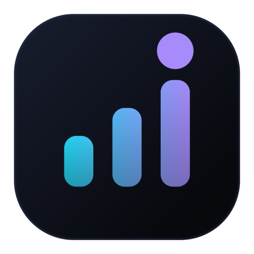
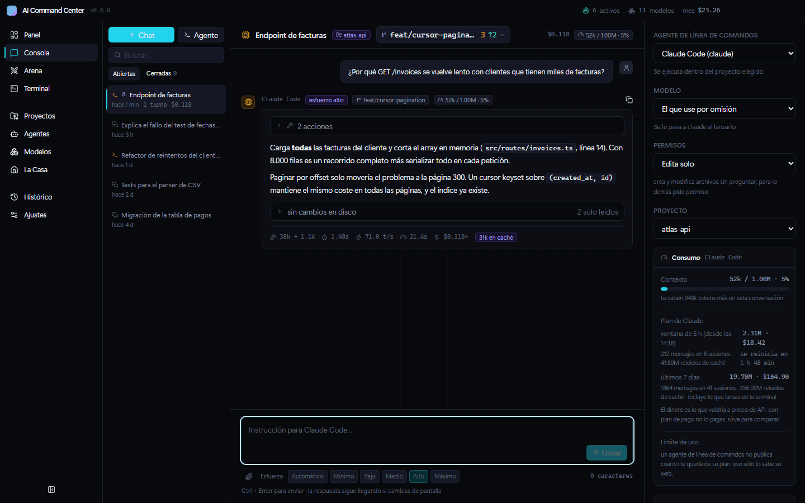
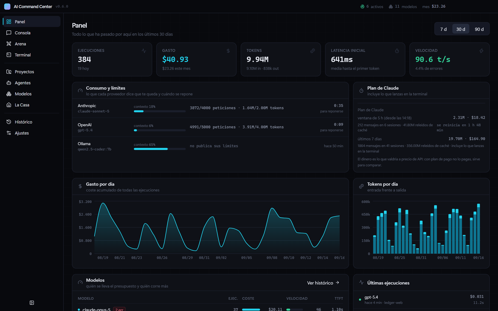
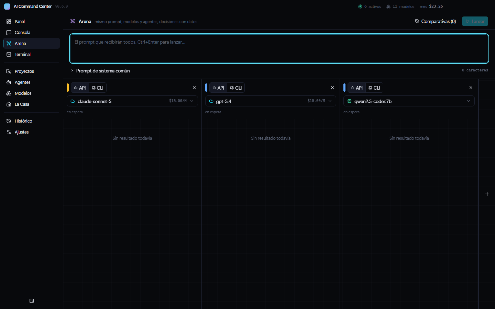
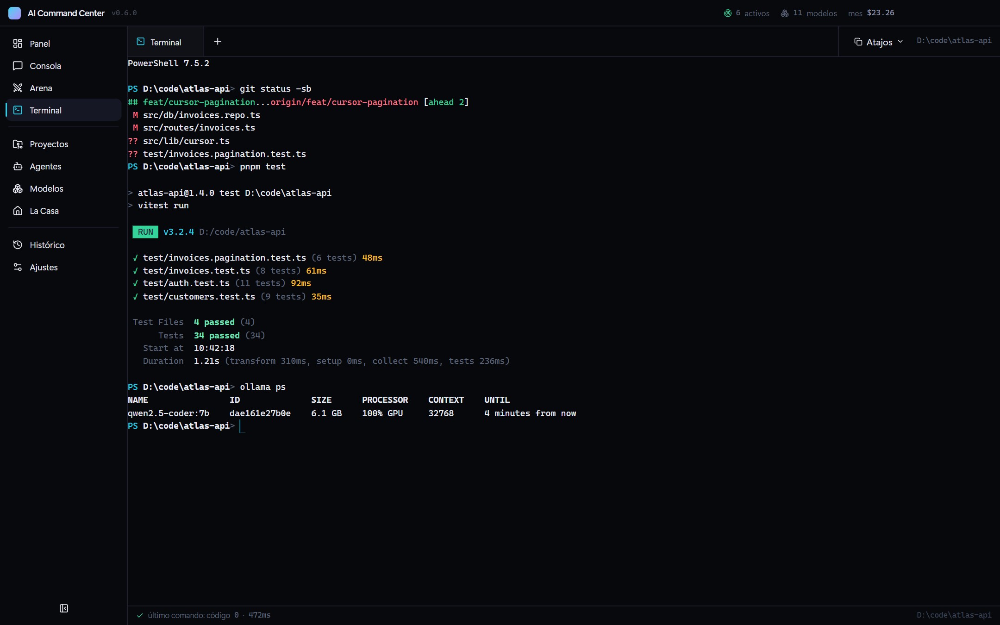
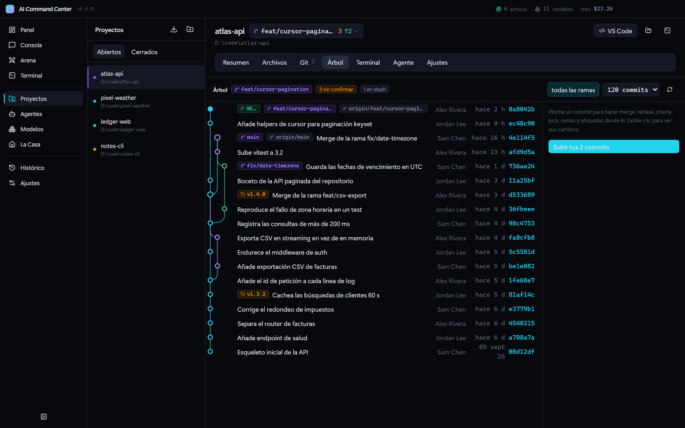
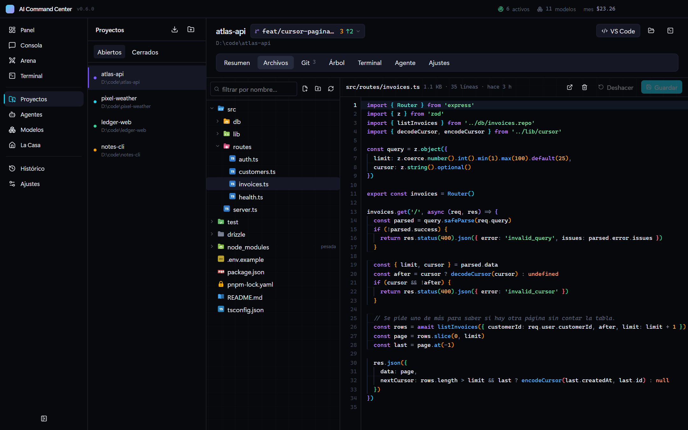
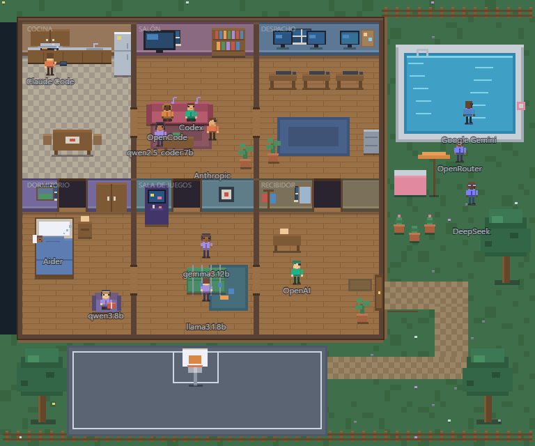

<div align="center">



# AI Command Center

[English](README.md) · **Español**

Centro de mando local para tus IAs, tus agentes y tus proyectos.
Todo en tu equipo: sin cuenta, sin servidor y sin telemetría.

[](https://github.com/Hredo/ai-command-center/actions/workflows/ci.yml)
[](https://github.com/Hredo/ai-command-center/releases/latest)
[](https://github.com/Hredo/ai-command-center/releases)
[](LICENSE)
[](#windows)
[](#macos)
[](#linux)

**[⬇ Descargar la última versión](https://github.com/Hredo/ai-command-center/releases/latest)**



<sub>Un agente de Claude Code trabajando en un proyecto, en directo. Todas las capturas usan datos inventados.</sub>

</div>

---

## Índice

- [Qué es](#qué-es)
- [Un vistazo](#un-vistazo)
- [**Instalación**](#instalación) — [qué archivo](#qué-archivo-me-descargo) · [Windows](#windows) · [macOS](#macos) · [Linux](#linux) · [compilarla](#compilarla-tú-mismo)
- [Verificar la descarga](#verificar-la-descarga)
- [Primeros pasos](#primeros-pasos)
- [Actualizar y desinstalar](#actualizar-y-desinstalar)
- [Problemas frecuentes](#problemas-frecuentes)
- [Qué hace](#qué-hace)
- [Proveedores](#proveedores)
- [Desarrollo](#desarrollo)
- [Publicar una versión](#publicar-una-versión)
- [Estructura](#estructura)
- [Dónde guarda los datos](#dónde-guarda-los-datos)
- [Contribuir](#contribuir)
- [Licencia](#licencia)

---

## Qué es

Una aplicación de escritorio para **Windows, macOS y Linux** que reúne en un solo sitio
tres cosas que normalmente están repartidas entre media docena de pestañas y terminales:

- **El acceso a tus IAs** — más de 8.000 modelos de 32 proveedores por API, los agentes
  de línea de comandos que ya tengas instalados (Claude Code, Codex, Aider, OpenCode…) y
  los modelos locales que corras con Ollama, todos desde la misma consola.
- **La analítica de lo que gastas** — coste por día, tokens, latencia hasta el primer
  token, velocidad de generación, tasa de error y ranking de modelos. Incluidas las
  sesiones que lanzaste fuera de la aplicación.
- **Tus proyectos** — ficheros, editor con coloreado, git completo con árbol de commits,
  GitHub, terminales reales y agentes ejecutándose dentro de cada carpeta.

Todo corre en local. Las claves se guardan cifradas con el sistema de credenciales de tu
propio sistema (DPAPI en Windows, el Llavero en macOS, GNOME Keyring o KWallet en Linux) y
el histórico vive en ficheros tuyos. No hay servidor, ni cuenta que crear, ni telemetría.

---

## Un vistazo

<table>
  <tr>
    <td width="50%" valign="top">
      <a href="docs/media/es/dashboard.png"></a>
      <p><b>Panel</b> — gasto, tokens, latencia y velocidad por modelo, lo que cada proveedor dice que te queda y tu consumo de Claude Code, incluidas las sesiones que abres en otras terminales.</p>
    </td>
    <td width="50%" valign="top">
      <a href="docs/media/es/arena.gif"></a>
      <p><b>Arena</b> — un mismo prompt, varios modelos o agentes contestando a la vez, y una tabla que marca al mejor en cada métrica.</p>
    </td>
  </tr>
  <tr>
    <td width="50%" valign="top">
      <a href="docs/media/es/terminal.png"></a>
      <p><b>Terminal</b> — consolas de verdad en pestañas (ConPTY en Windows, un pseudoterminal en macOS y Linux): las herramientas de pantalla completa y los agentes interactivos funcionan con sus colores.</p>
    </td>
    <td width="50%" valign="top">
      <a href="docs/media/es/graph.png"></a>
      <p><b>Árbol de git</b> — ramas, merges y etiquetas dibujados por proyecto; merge, rebase, cherry-pick o reset desde cualquier commit.</p>
    </td>
  </tr>
  <tr>
    <td width="50%" valign="top">
      <a href="docs/media/es/files.png"></a>
      <p><b>Archivos</b> — el árbol del proyecto y un editor con coloreado, guías de sangría y aviso cuando un agente te ha cambiado el fichero por detrás.</p>
    </td>
    <td width="50%" valign="top">
      <a href="docs/media/es/house.gif"></a>
      <p><b>La Casa</b> — cada IA que tienes vive aquí; las que tienen trabajo en marcha se levantan a hacer faena.</p>
    </td>
  </tr>
</table>

---

## Instalación

**[Windows](#windows)** · **[macOS](#macos)** · **[Linux](#linux)** · [compilarla tú](#compilarla-tú-mismo)

### ¿Qué archivo me descargo?

Está todo en la **[página de descargas](https://github.com/Hredo/ai-command-center/releases/latest)**,
en la sección **Assets**. Busca la línea de tu sistema:

| Tu sistema | Descarga | Qué es |
|---|---|---|
| **Windows** 10 u 11 | `AI-Command-Center-Setup-0.7.0.exe` | Instalador (recomendado) |
| | `AI-Command-Center-0.7.0-x64.zip` | Portátil, sin instalar nada |
| **macOS** con chip de Apple (M1, M2, M3, M4…) | `AI-Command-Center-0.7.0-mac-arm64.dmg` | Imagen de disco |
| **macOS** con procesador Intel | `AI-Command-Center-0.7.0-mac-x64.dmg` | Imagen de disco |
| **Ubuntu, Debian, Linux Mint, Pop!_OS**… | `AI-Command-Center-0.7.0-linux-amd64.deb` | Paquete, se instala con `apt` |
| **Cualquier otro Linux** (Fedora, Arch, openSUSE…) | `AI-Command-Center-0.7.0-linux-x86_64.AppImage` | Un solo archivo, sin instalar nada |
| Linux en **ARM** (Raspberry Pi 5, Ampere…) | `…-linux-arm64.deb` o `…-linux-arm64.AppImage` | Lo mismo, para ARM64 |

> **¿No sabes qué Mac tienes?** Menú Apple → **Acerca de este Mac**. Si pone *Chip Apple
> M…*, descarga `mac-arm64`; si pone *Procesador … Intel*, `mac-x64`.

### Requisitos

| | Windows | macOS | Linux |
|---|---|---|---|
| **Sistema** | Windows 10 (22H2 o superior) u 11, 64 bits | macOS 13 Ventura o posterior | 64 bits (x64 o ARM64). Probada en Ubuntu 24.04 |
| **Disco** | Unos 400 MB | Unos 400 MB | Unos 400 MB |
| **Administrador** | No hace falta | No hace falta | Sólo para el `.deb` (`sudo apt`). El AppImage no lo necesita |

No necesitas Node, ni Python, ni compiladores: va todo dentro.

Opcionales. Cada uno desbloquea una parte, y ninguno es obligatorio:

| Programa | Para qué | Windows | macOS | Linux (Debian/Ubuntu) |
|---|---|---|---|---|
| `git` | El panel de git y el árbol de commits | `winget install --id Git.Git` | `xcode-select --install` | `sudo apt install git` |
| `gh` | El panel de GitHub | `winget install --id GitHub.cli` | `brew install gh` | `sudo apt install gh` |
| [Ollama](https://ollama.com) | Modelos locales | `winget install --id Ollama.Ollama` | [la app de ollama.com](https://ollama.com/download/mac) o `brew install ollama` | [el `install.sh` de ollama.com](https://ollama.com/download/linux) |
| Cualquier agente CLI | Ejecutarlo desde la app | Claude Code, Codex, Aider, OpenCode, Gemini CLI… | igual | igual |

Lo que no tengas instalado aparece como «no encontrado» en su pantalla y el resto de la
aplicación funciona igual. No hay nada que se rompa por faltar.

> **Por qué todos los sistemas avisan la primera vez.** La aplicación no está firmada con
> un certificado de pago: en Windows cuesta entre 200 y 400 € al año, y en macOS Apple
> cobra 99 dólares al año por el programa que permite *notarizar* una app. Este proyecto
> es gratuito y no tiene ninguno de los dos. El aviso **no dice que el programa sea
> peligroso**: dice que nadie ha pagado por acreditar quién lo publica. El código está
> entero aquí, los binarios los [compila GitHub Actions a la vista de
> todos](#publicar-una-versión) —y allí se instala y se prueba cada paquete antes de
> publicarlo—, puedes [comprobar](#verificar-la-descarga) que lo que bajaste es
> exactamente lo que se compiló, o [compilarla tú](#compilarla-tú-mismo) y no descargar
> ningún binario.

---

### Windows

#### Opción A — Instalador (recomendado)

1. Descarga `AI-Command-Center-Setup-0.7.0.exe`.
2. Ejecútalo con doble clic. **Windows va a mostrarte un aviso azul**; es normal y está
   explicado [aquí abajo](#windows-te-va-a-avisar-por-qué-y-qué-hacer): pulsa **Más
   información** y después **Ejecutar de todas formas**.
3. Elige la carpeta de instalación o deja la que propone.
4. Al terminar tendrás el acceso directo en el escritorio y en el menú de inicio.

No pide permisos de administrador y no toca nada fuera de tu perfil de usuario.

#### Opción B — Versión portátil (sin instalar)

Útil si no quieres instalar nada, si vas a llevártela en un USB, o si el instalador se te
queda bloqueado.

1. Descarga `AI-Command-Center-0.7.0-x64.zip`.
2. **Antes de descomprimir**, haz clic derecho sobre el `.zip`, entra en **Propiedades**,
   marca **Desbloquear** abajo del todo y pulsa **Aceptar**.

   > Este paso importa. Windows marca todo lo que se descarga de internet, y esa marca se
   > contagia a cada archivo que salga del zip. Desbloqueando el zip antes, te ahorras el
   > aviso en todos los archivos de dentro.

3. Descomprime la carpeta donde quieras.
4. Entra y ejecuta **`AI Command Center.exe`**.

No escribe en el registro ni deja rastro fuera de su carpeta y de la carpeta de datos.
Para desinstalarla, se borra la carpeta.

#### Windows te va a avisar: por qué, y qué hacer

> **Windows protegió su PC**
>
> Windows Defender SmartScreen impidió el inicio de una aplicación no reconocida.
> Ejecutar esta aplicación puede poner en riesgo su PC.

Pulsa **Más información** y aparecerá el botón **Ejecutar de todas formas**. Eso es todo,
y sólo pasa la primera vez.

**Si no aparece «Ejecutar de todas formas»**, tienes activado **Smart App Control**, una
protección que viene de fábrica en las instalaciones limpias de Windows 11 y que bloquea
todo ejecutable sin firmar sin ofrecer ninguna opción. Tienes tres salidas, en este orden:

1. **Prueba la [versión portátil](#opción-b--versión-portátil-sin-instalar)**, acordándote
   de desbloquear el zip antes de descomprimir. A veces pasa donde el instalador no.
2. **[Compílala tú mismo](#compilarla-tú-mismo).** Lo que sale de tu propia máquina no
   pasa por ese filtro. Es la vía que siempre funciona.
3. Desactivar Smart App Control es técnicamente posible, pero **es irreversible sin
   reinstalar Windows entero**. No lo recomiendo por una aplicación: usa la opción 2.

---

### macOS

1. Descarga el `.dmg` de tu Mac: `mac-arm64` si tiene chip de Apple, `mac-x64` si es Intel.
2. Ábrelo y **arrastra *AI Command Center* a la carpeta *Aplicaciones*** que sale en la
   misma ventana.
3. Ábrela desde Aplicaciones o desde el Launchpad. **La primera vez macOS la bloquea**
   porque no está notarizada; así se le da paso, una sola vez:

   **macOS 15 Sequoia y posteriores (también macOS 26 Tahoe):**

   1. Haz doble clic en la app. Sale un aviso de que no se ha abierto *AI Command Center*
      (o de que Apple no ha podido comprobar que no contiene software malicioso). Pulsa
      **OK** — no *Trasladar a la Papelera*.
   2. Abre **Ajustes del Sistema → Privacidad y seguridad** y baja hasta la parte de
      *Seguridad*. Hay una línea que dice que se ha bloqueado *AI Command Center* para
      proteger tu Mac. Pulsa **Abrir igualmente**.
   3. Confírmalo con tu contraseña (o Touch ID) y pulsa otra vez **Abrir igualmente**.

   **macOS 13 Ventura y 14 Sonoma:** haz clic derecho (o Control-clic) sobre la app en
   Aplicaciones, elige **Abrir** y después **Abrir** otra vez en el aviso. El camino de
   *Ajustes del Sistema* de arriba también vale.

   A partir de ahí se abre como cualquier otra app.

4. La primera vez que un proyecto o una terminal entre en tus carpetas Documentos,
   Escritorio o Descargas, macOS te preguntará si AI Command Center puede acceder a ellas.
   Di **Permitir**: es donde viven tus proyectos.

> **¿Prefieres la Terminal?** Esto hace lo mismo que los pasos del punto 3 en una línea:
>
> ```bash
> xattr -dr com.apple.quarantine "/Applications/AI Command Center.app"
> ```

Cosas propias del Mac que ya están resueltas:

- **Tus herramientas de línea de comandos se encuentran aunque abras la app desde el
  Dock.** Una app de Mac no hereda el `PATH` de tu terminal, así que `claude`, `codex`,
  `opencode`, `gh` u `ollama` instalados con Homebrew, npm o pnpm serían invisibles. La
  app le pregunta a tu shell de inicio de sesión (zsh, bash o fish) por su `PATH` al
  arrancar.
- **Las claves van al Llavero de macOS**, atadas a tu usuario.
- **Los modelos locales usan la memoria unificada**: con chip de Apple no hay VRAM aparte,
  y las recomendaciones se calculan con la parte que macOS deja usar a la GPU.
- **Los atajos van con ⌘**: ⌘1…9 para cambiar de sección, ⌘Enter para enviar, ⌘C/⌘V para
  copiar y pegar en la terminal (donde Ctrl+C sigue siendo un Ctrl+C de verdad).

---

### Linux

#### Opción A — Paquete `.deb` (Ubuntu, Debian, Mint, Pop!_OS, elementary, Zorin…)

Desde la carpeta donde lo hayas descargado:

```bash
sudo apt install ./AI-Command-Center-0.7.0-linux-amd64.deb
```

(El `./` importa: sin él, `apt` busca en internet un paquete con ese nombre.) Aparece en
el menú de aplicaciones como **AI Command Center**, y se puede abrir desde una terminal con
`ai-command-center`. El paquete deja además bien configurado el aislamiento de Chromium,
incluido el perfil de AppArmor que piden Ubuntu 24.04 y posteriores.

#### Opción B — AppImage (cualquier distribución)

```bash
chmod +x AI-Command-Center-0.7.0-linux-x86_64.AppImage
```

```bash
./AI-Command-Center-0.7.0-linux-x86_64.AppImage
```

O dale permiso de ejecución desde el gestor de archivos (*Propiedades → Permisos →
Permitir ejecutar como programa*) y ábrelo con doble clic. No instala nada ni escribe
fuera de tu carpeta personal.

Los AppImage necesitan FUSE 2, que algunas distribuciones recientes ya no instalan de
serie. Si no se abre y una terminal enseña un error sobre `libfuse.so.2`:

| Distribución | Orden |
|---|---|
| Ubuntu 24.04 y posteriores | `sudo apt install libfuse2t64` |
| Ubuntu 22.04, Debian | `sudo apt install libfuse2` |
| Fedora | `sudo dnf install fuse-libs` |
| Arch, Manjaro | `sudo pacman -S fuse2` |

> **En Ubuntu 23.10 y posteriores, mejor el `.deb`.** Esas versiones sólo dejan usar los
> espacios de nombres con los que Chromium aísla sus ventanas a las apps que tienen un
> perfil de AppArmor, y sólo el `.deb` puede instalar uno. El AppImage abre y funciona
> igual —su lanzador detecta la restricción y arranca la app con `--no-sandbox` en vez de
> fallar—, pero sin ese aislamiento, y **Ajustes → Seguridad** lo dice. En Fedora, Arch y
> casi todas las demás distribuciones no existe esa restricción y el AppImage va aislado.

#### Las claves en Linux

Las claves se cifran con el llavero de tu sesión (GNOME Keyring o KWallet), que traen los
escritorios GNOME y KDE. En un escritorio sin llavero la app **no disimula**: la pantalla
de Seguridad te dice que las claves se guardan codificadas, no cifradas. Instala
`gnome-keyring`, o pasa las claves por variables de entorno (`ANTHROPIC_API_KEY`,
`OPENAI_API_KEY`…) en vez de guardarlas en la app.

---

### Compilarla tú mismo

Es la vía más limpia en cualquier sistema: lo que compilas en tu propia máquina no pasa
por ningún filtro de reputación, así que no hay avisos de ningún tipo.

Necesitas [Node 22](https://nodejs.org), `git` y **pnpm** —nunca npm: rompe el árbol de
`node_modules`—. Node trae pnpm consigo; se activa una vez con:

```bash
corepack enable pnpm
```

En macOS hacen falta además las herramientas de línea de comandos de Apple
(`xcode-select --install`), porque el módulo nativo de la terminal se compila al
instalar. En Windows y Linux no hace falta nada más: viene precompilado.

Y después:

```bash
git clone https://github.com/Hredo/ai-command-center.git
```

```bash
cd ai-command-center && pnpm install
```

```bash
pnpm dist
```

`pnpm dist` empaqueta para el sistema en el que lo ejecutas, en `release/`:

| Sistema | Lo que sale |
|---|---|
| Windows | El instalador y el zip portátil. Si tu Windows no deja generar el instalador, `pnpm dist:zip` produce sólo la versión portátil y no necesita lanzar ningún ejecutable durante el empaquetado |
| macOS | El `.dmg` de la arquitectura de tu Mac |
| Linux | El `.deb` y el AppImage de tu arquitectura |

Para trabajar sobre el código sin empaquetar nada: `pnpm dev`.

---

## Verificar la descarga

Cada Release incluye un archivo `SHA256SUMS.txt` con la huella de cada paquete. Para
comprobar que lo que has descargado es exactamente eso, ejecuta esto en la carpeta donde
lo descargaste:

| Sistema | Orden |
|---|---|
| Windows (PowerShell) | `Get-FileHash '.\AI-Command-Center-Setup-0.7.0.exe' -Algorithm SHA256` |
| macOS | `shasum -a 256 AI-Command-Center-0.7.0-mac-arm64.dmg` |
| Linux | `sha256sum -c SHA256SUMS.txt --ignore-missing` |

El valor tiene que coincidir, letra por letra, con la línea correspondiente de
`SHA256SUMS.txt` (en Linux la orden los compara por ti y dice `OK`). Si no coincide, **no
lo ejecutes**: bórralo y vuelve a descargarlo.

---

## Primeros pasos

La aplicación **arranca vacía a propósito**: no trae ninguna clave, no crea ninguna cuenta
y no se conecta a nada por su cuenta. Para que haga algo necesitas al menos una de estas
tres cosas.

### 1. Una clave de API

Sirve cualquiera de los [32 proveedores](#proveedores).

1. Abre **Ajustes** y entra en **Proveedores**.
2. Busca el tuyo y pega la clave.
3. Listo: ya aparece en la Consola, en la Arena y en el catálogo de Modelos.

> **Dónde acaba tu clave.** Se guarda cifrada con el sistema de credenciales de tu propio
> sistema, atado a tu cuenta de usuario —DPAPI en Windows, el Llavero en macOS, GNOME
> Keyring o KWallet en Linux—, en `secrets.json` dentro de la [carpeta de
> datos](#dónde-guarda-los-datos). No sale de tu equipo salvo hacia el proveedor al que se
> la mandas, y nunca se escribe en el histórico ni en los registros. Si prefieres no
> guardarla, la app también lee las variables de entorno habituales
> (`ANTHROPIC_API_KEY`, `OPENAI_API_KEY`, `GEMINI_API_KEY`…).

### 2. Un agente de línea de comandos

Si ya usas Claude Code, Codex, Aider, OpenCode o Gemini CLI, no necesitas ninguna clave:
la aplicación los busca en tu `PATH` y los ejecuta con tu sesión de siempre.

1. Abre **Agentes**. Los que tengas instalados salen detectados, con su versión.
2. Selecciona uno en la Consola y escribe.

### 3. Modelos locales, sin pagar nada a nadie

1. Instala [Ollama](https://ollama.com) y arráncalo.
2. Abre **Ajustes** y entra en **Local**. La app lo detecta solo en `localhost:11434`.
3. Desde ahí ves tu hardware, los modelos que tienes y las recomendaciones calculadas con
   la VRAM real de tu GPU (o, con chip de Apple, con la memoria unificada que macOS deja
   a la GPU). Se instalan y se borran con un botón.

---

## Actualizar y desinstalar

| Sistema | Actualizar | Desinstalar |
|---|---|---|
| Windows | Ejecuta el instalador nuevo encima del viejo | *Configuración → Aplicaciones*, o el desinstalador del menú de inicio. Portátil: borra la carpeta |
| macOS | Arrastra la versión nueva a *Aplicaciones* y elige **Reemplazar** | Arrastra la app de *Aplicaciones* a la Papelera |
| Linux `.deb` | `sudo apt install ./` seguido del nombre del `.deb` nuevo | `sudo apt remove ai-command-center` |
| Linux AppImage | Sustituye el archivo por el nuevo | Borra el archivo |

Actualizar conserva tu configuración, tus claves y todo el histórico. Para enterarte de
cuándo hay versión nueva, pulsa *Watch → Custom → Releases* arriba en este repositorio.

**Tus datos no se borran al desinstalar**, para que reinstalar no te deje a cero. Siguen
en la [carpeta de datos](#dónde-guarda-los-datos); si quieres borrarlos de verdad, elimina
esa carpeta a mano.

---

## Problemas frecuentes

| Sistema | Síntoma | Qué pasa | Solución |
|---|---|---|---|
| Windows | Windows dice «protegió su PC» | La app no está firmada | **Más información** → **Ejecutar de todas formas** |
| Windows | No sale el botón «Ejecutar de todas formas» | Smart App Control activo | [Usa el zip o compílala](#windows-te-va-a-avisar-por-qué-y-qué-hacer) |
| Windows | El antivirus la pone en cuarentena | Falso positivo habitual con binarios de Electron sin firmar | Verifica el [SHA-256](#verificar-la-descarga) y añade una excepción, o compílala tú |
| macOS | «No se ha abierto» / «no se puede abrir» | No está notarizada | **Ajustes del Sistema → Privacidad y seguridad → Abrir igualmente** ([paso a paso](#macos)) |
| macOS | «AI Command Center está dañado y no se puede abrir» | macOS lo dice cuando la marca de cuarentena y la firma no cuadran; no está dañada | `xattr -dr com.apple.quarantine "/Applications/AI Command Center.app"` |
| macOS | No encuentra un CLI que instalaste con la app abierta | El `PATH` se lee al arrancar la app | Ciérrala (⌘Q) y vuelve a abrirla |
| Linux | El AppImage no se abre; error sobre `libfuse.so.2` | Falta FUSE 2 | [Instálalo](#opción-b--appimage-cualquier-distribución), o usa el `.deb` |
| Linux | Seguridad dice que la app arrancó con `--no-sandbox` | El AppImage en Ubuntu 23.10+, que bloquea los espacios de nombres que necesita Chromium | Usa el `.deb`, que instala su perfil de AppArmor |
| Linux | Seguridad dice que las claves van «codificadas, no cifradas» | Tu sesión no tiene llavero | Instala `gnome-keyring`, o usa variables de entorno |
| Todos | La app abre pero está todo vacío | Es lo normal al principio | Añade una clave o un agente: ver [Primeros pasos](#primeros-pasos) |
| Todos | La terminal se abre y se queda colgada | Faltan los binarios de la consola nativa | Vuelve a descargar; si compilas tú, ejecuta `pnpm install` y luego `pnpm dist` |
| Todos | El panel de git dice que no hay git | `git` no está en el `PATH` | Instálalo ([tabla](#requisitos)) y reinicia la app |
| Todos | El panel de GitHub pide iniciar sesión | Falta la CLI de GitHub | Instálala ([tabla](#requisitos)), después `gh auth login --web` |
| Todos | Ollama no aparece | El servidor no está corriendo | Arráncalo, o usa el botón de **Ajustes → Local** |
| Todos | Un proveedor responde 401 | Clave incorrecta o caducada | Vuelve a pegarla en **Ajustes → Proveedores** |

¿Nada de esto lo arregla? [Abre una incidencia](https://github.com/Hredo/ai-command-center/issues/new/choose)
contando tu sistema y su versión, cómo instalaste la app y qué hiciste justo antes.

---

## Qué hace

**Panel** — gasto por día, tokens de entrada y salida, latencia media hasta el primer token,
velocidad de generación, tasa de error y ranking de modelos por coste y rendimiento.

**Consola** — conversaciones con cualquier modelo o con un agente de línea de comandos.
Mientras responde se ven sus métricas en vivo (tiempo, primer token, tokens y velocidad
estimados); al terminar se sustituyen por las reales del proveedor. Cada conversación es
una sesión que puedes cerrar, reabrir, renombrar, fijar o borrar, y que sobrevive al
cierre de la aplicación.

Alrededor de cada turno se ve lo que el modelo o el agente informa de verdad:

- **Razonamiento** desplegable, cuando lo publica. De la API salen los bloques de
  pensamiento de Anthropic, el `reasoning_content` de los compatibles con OpenAI, los
  *thoughts* de Gemini y el `thinking` de Ollama. De los agentes de línea de comandos,
  los bloques `thinking` de Claude Code y los eventos `reasoning` de OpenCode. Si un
  agente no lo publica, se dice; no se reconstruye adivinando sobre su salida.
- **Contexto** consumido sobre la ventana del modelo, en tokens y en porcentaje.
- **Límite de uso**: lo que queda de peticiones y de tokens, y cuándo se repone. Sale de
  las cabeceras de la respuesta del proveedor, así que sólo aparece si él lo manda.

Y en la barra lateral de la conversación, un panel de **consumo** con las tres cosas
separadas: cuánto contexto llevas gastado y cuánto te cabe todavía, cuántas peticiones y
tokens te quedan del plan, y una cuenta atrás hasta que se repongan. Lo que el proveedor
no publica se dice con esas palabras, en vez de dibujar una barra a medias. El Panel
recoge lo mismo de todos los proveedores que hayan contestado desde que abriste la app.

Para **Claude Code** hay además su propio apartado: lo que llevas gastado en la ventana de
cinco horas y en los últimos siete días, con los mensajes y las sesiones de cada una, y la
cuenta atrás hasta el reinicio cuando el propio agente lo anuncia. Cuenta también lo que
lanzas fuera de la aplicación, porque sale de las transcripciones que Claude Code deja en
`~/.claude/projects`. Dos avisos que el panel da por escrito: los tokens releídos de caché
van aparte —si se sumaran con los demás saldrían cientos de millones en una tarde— y el
dinero es lo que costaría a precio de API, que con plan de pago no es lo que pagas. El
tope del plan no lo publica nadie, así que no se pinta ningún porcentaje: se enseña el
gasto real y la hora del reinicio, y ahí se para.

- **Archivos que toca**: los que cambiaron de verdad, medidos comparando el repositorio
  antes y después, con sus líneas añadidas y quitadas; y aparte los que el agente dice
  haber abierto, distinguiendo lo que sólo leyó de lo que editó.
- **Rama** en la que se ejecutó, con un selector para cambiar de rama o crear una nueva.
- **Adjuntos**: eliges ficheros y van con el prompt. A un modelo por API se le manda el
  contenido (recortado si se pasa de tamaño, y avisando); a un agente de línea de
  comandos, las rutas, que ya sabe abrirlas.
- **Esfuerzo** de razonamiento, de mínimo a máximo. Cada proveedor lo pide a su manera y
  se traduce solo: presupuesto de pensamiento en Anthropic y Gemini, `reasoning_effort`
  en OpenAI, `think` en Ollama, y la opción propia del CLI en claude, codex y aider. En
  «Automático» no se manda nada, así que la petición sale igual que siempre. Si el
  proveedor rechaza el campo, se reintenta sin él en vez de fallar.
- **Qué está haciendo el agente**, paso a paso y mientras lo hace: cada pensamiento y cada
  herramienta con su nombre, sobre qué fichero o qué comando, cuánto tardó, si salió bien
  o mal y el **+N −M** de lo que editó. Arriba, el resumen de la tanda: cuántas acciones,
  cuánto se añadió y se quitó y en cuántos ficheros. Mientras corre está abierto para que
  se vea que no se ha colgado; al terminar se pliega y deja la respuesta limpia. Lo que
  el agente no cuenta no se dibuja: si una herramienta no dice cuántas líneas tocó, no
  sale el contador.
- **Modelo y permisos del agente de consola**, cuando su CLI los admite. En Claude Code se
  elige el modelo (Fable, Opus, Sonnet, Haiku) y con qué manga ancha trabaja: que edite
  solo, que haga todo sin preguntar, que se quede en el plan o que pregunte. Los permisos
  denegados aparecen en la línea de tiempo como lo que son, un paso que no se dejó hacer.

**Arena** — el mismo prompt contra dos, tres o cuatro contendientes a la vez, en columnas
y en streaming simultáneo. Un contendiente puede ser un modelo por API o un agente de
línea de comandos: los dos acaban en la misma tabla comparativa, que resalta el mejor en
cada métrica. Marcas un ganador y queda guardado.

**Terminal** — terminales de verdad dentro de la aplicación, en pestañas. Detrás hay una
consola real (ConPTY en Windows, un pseudoterminal en macOS y Linux), así que funcionan las
aplicaciones de pantalla completa: opencode, vim, los agentes en modo interactivo, todo con
sus colores y su interfaz. Ctrl+C es un Ctrl+C auténtico. La ruta de cada pestaña y la
duración de cada comando salen de una integración de shell que sólo añade marcadores
invisibles al prompt —para PowerShell, bash, zsh y fish—, y que carga antes tu propia
configuración, así que tu prompt, tus alias y tu `PATH` quedan tal cual. En macOS cada
terminal nueva es de inicio de sesión, como en Terminal.app.

**Proyectos** — registras carpetas y desde ahí las abres en VS Code o en tu gestor de
archivos (el Explorador, el Finder…),
tienes una terminal propia del proyecto, y lanzas agentes dentro con su salida en directo.
La app escanea el proyecto: rama de git, lenguajes, gestor de paquetes, dependencias de IA
y nombres (nunca valores) de las variables de su `.env`. Los scripts del `package.json` se
ejecutan pinchándolos, en la terminal integrada. Un proyecto se puede **cerrar**: sigue
guardado con su historial pero sale de la lista, y se reabre cuando quieras.

Cada proyecto tiene además:

- **Archivos** — árbol de carpetas que se abre por niveles (las pesadas, como
  `node_modules`, se marcan y sólo se leen si las abres tú), y un editor con Ctrl+S,
  numeración de líneas y aviso si el fichero cambió en disco desde que lo abriste, que es
  lo que pasa cuando un agente ha estado trabajando por detrás. El código va **coloreado**
  —comentarios, textos, números, palabras reservadas, tipos y llamadas— con **guías de
  indentación** que marcan cada nivel, y el Tabulador tabula en vez de saltar de control.
  El coloreado es propio, sin librería: unas cuantas expresiones regulares por familia de
  lenguaje (TypeScript, JavaScript, Python, shell, JSON, CSS, HTML, YAML, SQL, Go, Rust,
  C, Java, PHP, Ruby y Markdown). Los mismos colores se aplican a los bloques de código de
  las respuestas del chat, adivinando el lenguaje cuando la valla del markdown no lo dice.
  Crear, mandar a la papelera y mostrar en el Explorador o en el Finder. Toda ruta se
  resuelve contra la
  raíz del proyecto: un `..` de más se rechaza.
- **Git** — qué ha cambiado con sus líneas, el diff de cada fichero, preparar, confirmar,
  apartar en el stash y recuperarlo, fetch, pull, push, y una caja para cualquier otro
  comando de git. La caja no es una shell: el comando se parte en argumentos y va directo
  a git, sólo se aceptan subcomandos de una lista, y los que pueden tirar trabajo (`reset
  --hard`, `push --force`) piden confirmación. Lo interactivo (un `rebase -i`, que abriría
  un editor) se manda a la terminal integrada, donde sí tiene sentido.
- **Árbol** — el histórico dibujado: un carril por rama, los merges con su curva, y las
  etiquetas de cada rama local, remota o `tag` sobre su commit. Pinchando un commit se
  hace **merge**, **rebase**, **cherry-pick**, **revert**, se crea una rama o una etiqueta
  ahí mismo, se va a ese punto o se vuelve a él conservando o tirando lo posterior. Si un
  merge o un rebase se queda a medias, arriba sale qué está pasando, por qué commit va y
  qué ficheros están en conflicto —se abren en el editor de un clic— con **continuar**,
  **saltar** y **abortar**. Las acciones no son texto libre: la interfaz dice qué quiere
  hacer y el proceso principal arma la llamada a git, así que un nombre de rama no puede
  colar una opción. Git corre sin editor y sin preguntas (`GIT_EDITOR=true`), de forma que
  nada se queda esperando a un teclado que no existe.
- **GitHub** — inicias sesión con su CLI oficial (`gh auth login --web`): se abre el
  navegador y autorizas tú. La aplicación no ve ni guarda tu contraseña ni tu token;
  sólo le pregunta a `gh` con qué cuenta está. Desde ahí ves tus repositorios, los
  buscas, y clonas cualquiera eligiendo carpeta: queda dado de alta como proyecto en el
  mismo gesto.

**Agentes** — dos tipos, y los dos trabajan como agentes: usan herramientas y dan las
vueltas que haga falta hasta acabar la tarea. Los de API son un modelo con sus
instrucciones, su esfuerzo y sus permisos: leen, buscan, editan y ejecutan comandos con las
herramientas de la app, en el proyecto o, si no hay, en su propia carpeta. Los de línea de
comandos son los CLIs que ya tienes instalados (Claude Code, Codex, opencode, Aider, Gemini
CLI…): la app los busca en tu PATH y los ejecuta dentro del proyecto. De Claude Code y
OpenCode extrae tokens y coste reales. A OpenCode le eliges proveedor —Zen o tus modelos de
Ollama—, modelo y esfuerzo; con Ollama, cada modelo va siempre con su ventana de contexto
entera.

Y también las sesiones que **no** lanzaste desde aquí: si abres `claude` en una terminal
cualquiera, esa conversación entra igualmente en el histórico y en las estadísticas, con
su proyecto, su modelo, sus mensajes y sus ficheros tocados, marcada como venida de fuera.
Se lee de las transcripciones de Claude Code, que crecen por el final y nunca se
reescriben, así que se repasan una vez enteras y después sólo lo que se haya añadido;
mientras tanto se vigila la carpeta, de modo que una sesión que sigue viva aparece
mientras trabajas, no cuando te acuerdes de mirar.

**Modelos** — catálogo dinámico con más de 8.000 modelos de 200 proveedores y sus precios,
descargado de models.dev y OpenRouter. Pinchas un modelo y se abre su ficha: contexto,
precios, modalidades y enlaces a su página, a sus pesos o a su documentación. Cuando un
proveedor no publica página por modelo, se dice y se enlaza su lista en vez de inventar
una dirección.

**Local** (en Ajustes) — gestión de Ollama sin salir de la app: estado del servidor y
botón para arrancarlo, tu hardware, los modelos instalados con su peso, y recomendaciones
calculadas con la VRAM real de tu GPU y el peso real de cada modelo según el registro de
Ollama. Se instalan y se borran desde ahí, con barra de progreso.

**La Casa** — la única pantalla que no sirve para configurar nada: sirve para mirar. Cada
IA que la aplicación detecta —cada agente de consola, cada modelo local, cada proveedor con
llave— vive en una casa dibujada píxel a píxel, en planta y vista de tres cuartos, con
cocina, salón, despacho, dormitorio, sala de juegos, jardín, piscina y cancha de baloncesto.

Si no le mandas nada, cada uno anda descansando: en el sofá, echando una cabezada, en la
máquina recreativa, en el agua o tirando a canasta, y de vez en cuando se cambia de sitio.
Si le mandas una tarea, se levanta y se pone a hacer faena por la casa —cocinar, fregar,
barrer, regar, teclear en el despacho—. Y si le mandas dos a la vez, entra por la puerta
de la calle otro vecino idéntico para la segunda, que se marcha por donde vino en cuanto
esa tarea termina. Al pasar el ratón por encima dice quién es y qué está haciendo.

Todo el dibujo es propio: no hay imágenes, ni sprites descargados, ni nada generado fuera.
Se pinta en un lienzo de 768 por 640 puntos y se agranda por un número entero con el
suavizado apagado, que es lo que hace que los píxeles salgan cuadrados en vez de
emborronados. La animación se para sola cuando te vas a otra pestaña.

**Histórico** — todas las ejecuciones con filtros, ficha detallada y exportación a CSV o JSON.

**Notificaciones** — avisos del sistema al terminar un prompt, un agente, una comparativa,
una descarga de modelo o un comando de terminal que haya tardado más de doce segundos.

### Detalles que importan

**Nada se interrumpe al cambiar de pantalla, ni al cambiar de ventana.** Las
conversaciones, los agentes, las terminales y la Arena viven en un almacén global del
renderer, no en las páginas: una pantalla que has visitado se queda montada y sólo se
esconde, así que no se pierde el scroll, ni la pestaña de terminal abierta, ni lo que
tuvieras a medio escribir. Cada terminal mantiene su emulador vivo; al volver a ella se
reajusta al tamaño y recupera el foco, sin repintar el historial desde cero.

Y lo mismo si te vas a otra aplicación. Chromium deja de dar fotogramas cuando su ventana
está minimizada o tapada, y el texto que iba llegando se quedaba esperando un fotograma
que no llegaba nunca: al volver aparecía todo de golpe y parecía que la IA se había
colgado. Ahora hay un temporizador de respaldo —corre el que llegue antes— y la ventana
pide no ser frenada en segundo plano. Cuesta algo de batería y a cambio lo que corre por
detrás corre de verdad. La barra superior y la lateral muestran cuántas tareas hay en
marcha y dónde.

**La pantalla no se queda vieja.** El proceso principal vigila la carpeta de cada
proyecto —`fs.watch` para enterarse al momento y un repaso cada cuatro segundos por lo que
se le escape— y avisa a la interfaz cuando el repositorio cambia. Confirmar desde la app,
desde una terminal de fuera o desde un agente da igual: la lista de cambios, la rama, el
árbol y el explorador de ficheros se ponen al día solos, sin pulsar «releer». Sólo se manda
aviso cuando el estado cambia de verdad, así que un repaso que no encuentra nada no
repinta nada. Lo mismo con el gasto y el histórico: se releen al terminar cada ejecución.

**Los motores locales se detectan solos.** El proceso principal sondea sus puertos cada
pocos segundos y avisa al renderer cuando uno aparece o desaparece: arrancar Ollama con la
app abierta se nota sin pulsar nada. Si el motor sólo responde por una de las dos
direcciones (`127.0.0.1` o `localhost`), se guarda la que funciona.

### Seguridad

La ventana del renderer corre con `sandbox`, `contextIsolation` y sin acceso a Node. No
puede navegar a ningún sitio, abrir ventanas nuevas ni pedir cámara, micrófono o
ubicación. Una política de contenido (CSP) impide cargar nada que no sea suyo. Los
mensajes que llegan por IPC se comprueban: que vengan de la ventana correcta, y que los
argumentos sean del tipo y del tamaño que se espera. Abrir un enlace externo significa
`http(s)` y nada más. Todo eso vive en [`src/main/security.ts`](src/main/security.ts), y
la aplicación lo enseña en su propia pantalla de Seguridad: si alguien afloja un ajuste,
se ve.

---

## Proveedores

32 en el catálogo, hablando cuatro protocolos: Anthropic, OpenAI (y los ~20 compatibles),
Google Gemini y Ollama nativo.

**En la nube** — Anthropic, OpenAI, Google, OpenRouter, Groq, DeepSeek, xAI, Mistral,
Together, Fireworks, Cerebras, Perplexity, Cohere, Moonshot, Zhipu, Qwen, NVIDIA,
SambaNova, Nebius, Hyperbolic, Hugging Face, GitHub Models y Azure OpenAI.

**En local**, detectados por sondeo de puertos — Ollama, LM Studio, llama.cpp, vLLM, Jan,
LocalAI, GPT4All, KoboldCpp y Text generation WebUI.

---

## Desarrollo

Requiere Node 22 y **pnpm** (nunca npm: rompe el árbol de `node_modules`), en Windows,
macOS o Linux; en macOS, además, las herramientas de línea de comandos de Apple
(`xcode-select --install`). Para el panel de git hace falta `git` en el PATH, y para
GitHub su CLI oficial (ver la [tabla](#requisitos)); sin ella el resto de la aplicación
funciona igual y el panel lo dice.

`pnpm dist` prepara y comprueba antes de empaquetar los binarios de la consola real
(`scripts/check-native.cjs`). Sin esa comprobación se puede generar un instalador que
arranca bien y deja la terminal colgada al abrir la primera pestaña: pasó una vez, porque
un `node-gyp` fallido había vaciado `build/Release`.

```bash
pnpm install
pnpm dev            # app en caliente con recarga
pnpm build          # compila a out/
pnpm dist           # empaqueta para el sistema en el que estás, en release/
pnpm dist:win       # Windows: instalador y zip portátil
pnpm dist:zip       # Windows: sólo la versión portátil
pnpm dist:mac       # macOS: el .dmg de la arquitectura de este Mac
pnpm dist:linux     # Linux: .deb y AppImage
pnpm typecheck      # comprueba los tipos de los dos procesos
```

**Autoprueba.** La aplicación sabe comprobarse sola: arrancada con
`ACC_SELFTEST=<carpeta>`, abre con datos de usar y tirar, prueba la ventana, una terminal
real con cada shell que encuentre (bash, zsh, fish o PowerShell), los comandos del agente y
el `PATH` del usuario, deja `selftest.json` y dos capturas en esa carpeta y sale con 0 o 1.
[`scripts/selftest.sh`](scripts/selftest.sh) la lanza como lo haría el Dock o un lanzador
de escritorio, con el entorno vacío. Es lo que pasa la CI en cada sistema
([`src/main/selftest.ts`](src/main/selftest.ts)).

Verificación:

```bash
pnpm exec electron scripts/smoke.cjs         # arranca y captura pantalla
pnpm exec electron scripts/test-engine.cjs   # motor de streaming, con un SSE falso
pnpm exec electron scripts/test-pty.cjs      # terminal real: opencode, Ctrl+C, códigos
pnpm exec electron scripts/test-terminal.cjs # el motor de respaldo por tuberías
pnpm exec electron scripts/test-features.cjs # sesiones, enlaces, detección, avisos
pnpm exec electron scripts/test-agents.cjs   # razonamiento, contexto, límites, archivos, esfuerzo
pnpm exec electron scripts/test-workspace.cjs # ficheros del proyecto, git y GitHub
pnpm exec electron scripts/shot.cjs Terminal # capturas de una sección
python scripts/make-icon.py                  # regenera build/icon.png
```

`scripts/ollama-setup.cjs` deja Ollama con los mejores modelos para el equipo. Con
`--dry-run` sólo informa de lo que haría.

Las pruebas usan un servidor SSE local y agentes de mentira —un script de Node que emite
los mismos eventos que Claude Code y OpenCode, capturados de las dos herramientas
reales—, así que no gastan tokens ni tocan ninguna cuenta. Las de git y ficheros montan un
repositorio temporal y lo borran al acabar.

### Dependencias nativas

Sólo una: `@homebridge/node-pty-prebuilt-multiarch`, que es la que da la consola real.
Es un módulo N-API: el mismo binario vale para cualquier versión de Node y de Electron, y
no hay que recompilar nada para Electron. Cómo llega a `build/Release` depende del sistema,
y `scripts/check-native.cjs` se encarga de los tres:

- **Windows**: su script de instalación lo descarga precompilado; **no** hace falta Visual
  Studio.
- **Linux**: viene precompilado, pero en `prebuilds/linux-<arquitectura>/`, que no es
  donde se busca dentro de Electron; el script lo copia a su sitio.
- **macOS**: se compila al instalar (de ahí las herramientas de línea de comandos), junto
  con `spawn-helper`, que tiene que poder ejecutarse o cada pestaña muere con
  `posix_spawnp failed`.

Si algún día no cargara, la terminal cae sola a un motor por tuberías que organiza la
salida en bloques; se pierde lo interactivo pero la app sigue funcionando, y lo dice en
pantalla.

El resto no tiene nada nativo a propósito: el histórico es JSONL en vez de SQLite.

pnpm 11 exige autorizar los scripts de instalación en `allowBuilds`, dentro de
`pnpm-workspace.yaml`. Sin eso el módulo se instala sin binario y en silencio.

---

## Publicar una versión

Los binarios los genera GitHub Actions, no la máquina de desarrollo: es la única forma de
tener a mano, cada vez, un Windows, un Mac de cada arquitectura y un Linux de cada
arquitectura. Para Windows hay además una razón concreta: en la máquina de desarrollo
Smart App Control está activado y en modo de imposición, así que el instalador NSIS **no
se puede ni generar** —electron-builder necesita lanzar un ejecutable temporal para
escribir el desinstalador y Windows no le deja—.

Publicar es empujar una etiqueta:

```bash
git tag v0.7.0 && git push origin v0.7.0
```

[`.github/workflows/release.yml`](.github/workflows/release.yml) genera, en máquinas
limpias de GitHub, el instalador y el zip de Windows, el `.dmg` para chip de Apple y para
Mac con Intel, y el `.deb` y el AppImage para Linux x64 y ARM64. Después **instala cada
uno como lo haría un usuario** —el `.dmg` arrastrado a Aplicaciones, el `.deb` con `apt`
y con las restricciones de AppArmor de Ubuntu puestas— y le pasa la
[autoprueba](#desarrollo); en el Mac, además, abierta desde el Finder, con el entorno
mínimo de launchd. Sólo si pasan todos calcula los SHA-256 y publica la Release. Lanzado
desde la pestaña *Actions* sin etiqueta hace lo mismo y no publica nada.
[`.github/workflows/ci.yml`](.github/workflows/ci.yml) compila y pasa la autoprueba en
Windows, macOS y Linux en cada empujón y en cada pull request.

La app de Mac va firmada *ad hoc* —no cuesta nada y es lo que necesitan los chips de
Apple para ejecutarla siquiera—, pero no está notarizada: eso exige el programa de
desarrolladores de pago de Apple, y de ahí los [pasos de la primera vez](#macos).

### Actualizar una instalación de Windows sin instalador

Todo el código de la aplicación vive en `resources\app.asar`, así que en una máquina donde
el instalador esté bloqueado basta con sustituir eso y dejar el ejecutable —que Windows ya
tiene permitido— en paz:

```bash
pnpm build && pnpm exec electron-builder --win --dir
```

```bash
powershell -ExecutionPolicy Bypass -File .\scripts\actualizar-instalacion.ps1
```

El script pide elevación, cierra la aplicación si está abierta, guarda una copia fechada
en `release\respaldo-<fecha>` y copia lo nuevo. Para volver atrás, se copia el `app.asar`
del respaldo encima. Sólo vale mientras la versión de Electron no cambie.

---

## Estructura

```
src/
  shared/types.ts      contrato común entre los tres procesos
  main/
    index.ts           ventana, ciclo de vida y CSP
    ipc.ts             canales principales, con errores convertidos en mensajes
    ipcExtra.ts        terminales, sesiones, Ollama, enlaces y avisos
    config.ts          config.json
    secrets.ts         claves cifradas con el llavero del sistema (DPAPI, Llavero,
                       Secret Service)
    platform.ts        lo que cambia entre Windows, macOS y Linux
    shellEnv.ts        el PATH de la shell del usuario, para abrirla desde el Dock
    selftest.ts        la autoprueba que pasa la CI en cada sistema
    runs.ts            histórico en JSONL y agregación de métricas
    sessions.ts        conversaciones que se pueden cerrar y retomar
    terminal.ts        consola real (ConPTY, o un pseudoterminal en macOS y Linux),
                       integración de shell y respaldo por tuberías
    ollama.ts          estado, hardware, descargas y recomendaciones
    notify.ts          notificaciones del sistema
    detect.ts          detección de proveedores, CLIs y motores locales
    projects.ts        escaneo de proyectos
    files.ts           ficheros del proyecto, sin salir de su raíz
    git.ts             estado, ramas, diffs, árbol de commits y operaciones
    watch.ts           vigila cada proyecto y avisa cuando el repositorio cambia
    usage.ts           lo último que dijo cada proveedor sobre tus límites
    claudeSessions.ts  lee las transcripciones de Claude Code: ventanas de uso y
                       sesiones lanzadas fuera de la aplicación
    claudeWatch.ts     vigila esa carpeta para que una sesión viva salga en marcha
    github.ts          sesión y repositorios a través de gh
    attach.ts          adjuntos del prompt
    effort.ts          el esfuerzo, traducido a cada proveedor
    security.ts        endurecimiento: CSP, permisos y validación de IPC
    providers/
      catalog.ts       los 32 proveedores
      models.ts        catálogo dinámico y cálculo de precios
      links.ts         de un modelo a su página
      run.ts           motor de streaming: 4 dialectos y métricas
      limits.ts        límites de uso leídos de las cabeceras
    agents/cli.ts      ejecución de agentes de línea de comandos
  preload/index.ts     puente aislado hacia el renderer
  renderer/
    lib/engine.tsx     estado vivo de todo, fuera de las páginas
    lib/ansi.ts        intérprete de secuencias ANSI para el modo respaldo
    lib/highlight.ts   coloreado de código y guías de indentación, sin librería
    lib/house.ts       el plano de La Casa: habitaciones, puertas, sitios y el
                       vaivén de los vecinos
    lib/pixelArt.ts    el dibujo de La Casa, píxel a píxel, sin imágenes
    lib/i18n.tsx       los textos, en español y en inglés
    components/        Terminal (xterm.js), FilesPanel, Code (editor coloreado),
                       GitPanel, GitGraph (árbol, merges y rebases), GithubPanel,
                       AgentPanel (contexto, consumo, plan de Claude, ramas),
                       AgentActivity (lo que va haciendo el agente), HouseCanvas,
                       Stats…
    pages/             las diez secciones
```

---

## Dónde guarda los datos

| Sistema | Carpeta |
|---|---|
| Windows | `%APPDATA%\AI Command Center\data\` |
| macOS | `~/Library/Application Support/AI Command Center/data/` |
| Linux | `~/.config/AI Command Center/data/` |

| Fichero | Qué lleva |
|---|---|
| `config.json` | Proveedores, agentes, proyectos y preferencias |
| `secrets.json` | API keys cifradas con el llavero del sistema |
| `runs.jsonl` | Una línea por ejecución, con todas sus métricas |
| `sessions.json` | Conversaciones y sesiones de agente |
| `models-cache.json` | Catálogo de modelos y precios |
| `shell-init.ps1`, `shell/` | Integración de shell que carga la terminal (PowerShell; bash, zsh y fish) |

Se abre desde **Ajustes → Preferencias → Abrir carpeta de datos**.

Nada de esto sale de tu equipo. No hay servidor al que mandarlo, ni telemetría, ni
comprobación de licencia.

---

## Contribuir

Las aportaciones son bienvenidas, por el camino habitual de GitHub:

1. Haz un **fork** del repositorio.
2. Crea una rama para tu cambio (`git checkout -b arregla-lo-que-sea`).
3. Comprueba que pasa `pnpm typecheck` y `pnpm build`.
4. Abre un **pull request** contra `main`.

**La rama `main` está protegida.** No se puede empujar a ella directamente, ni forzar el
histórico, ni borrarla: todo entra por pull request, con la CI en verde, y el merge lo
aprueba el responsable del repositorio. Por eso el paso 1 es un fork.

Para informar de un fallo, usa la
[plantilla de incidencias](https://github.com/Hredo/ai-command-center/issues/new/choose):
pide la versión y cómo instalaste la app, que es lo que hace falta para reproducirlo.

---

## Licencia

[MIT](LICENSE) — © 2026 Hredo.

Puedes usarlo, modificarlo y distribuirlo, incluso comercialmente, conservando el aviso de
copyright. Se entrega **sin garantía de ningún tipo**.
