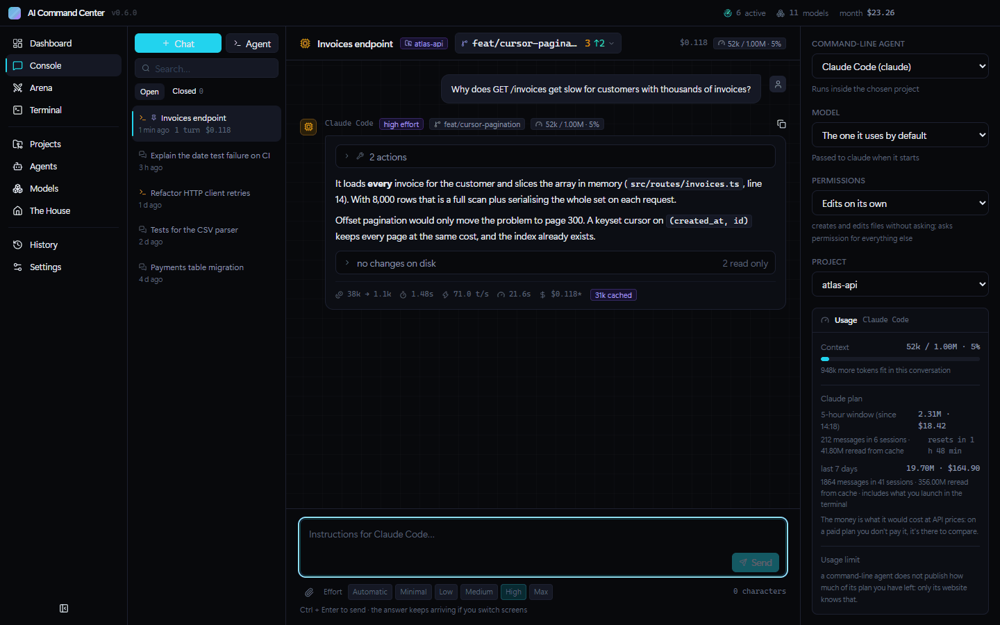
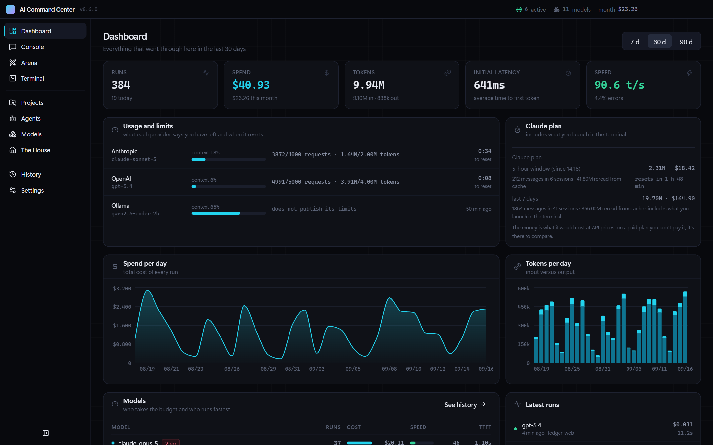
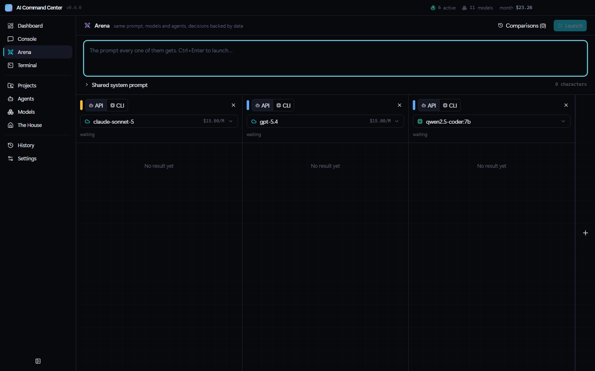
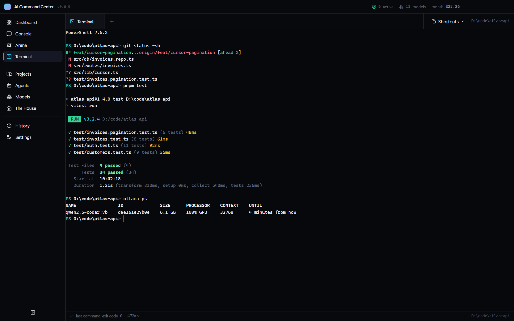
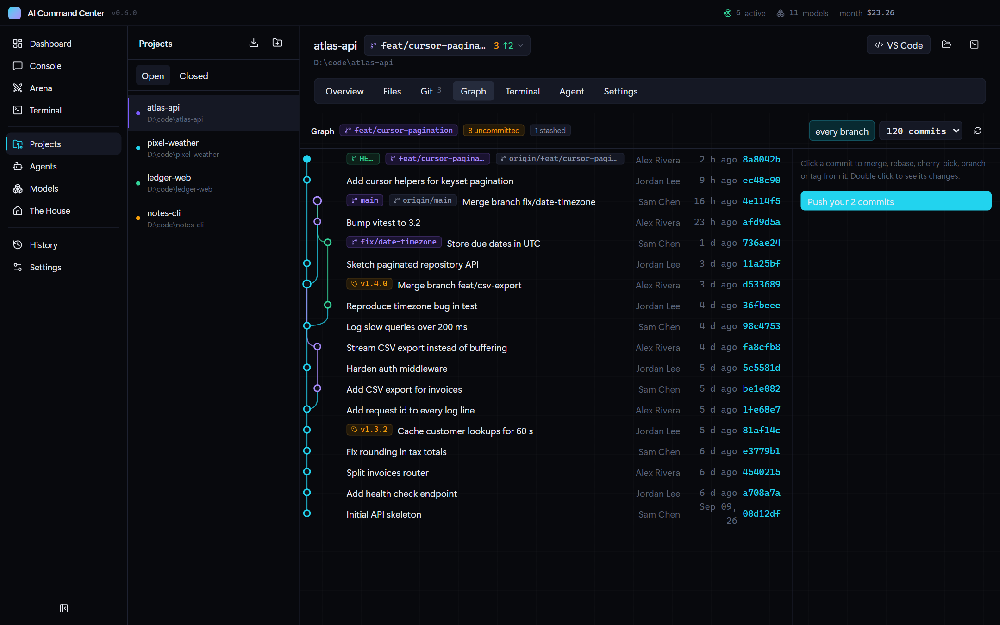
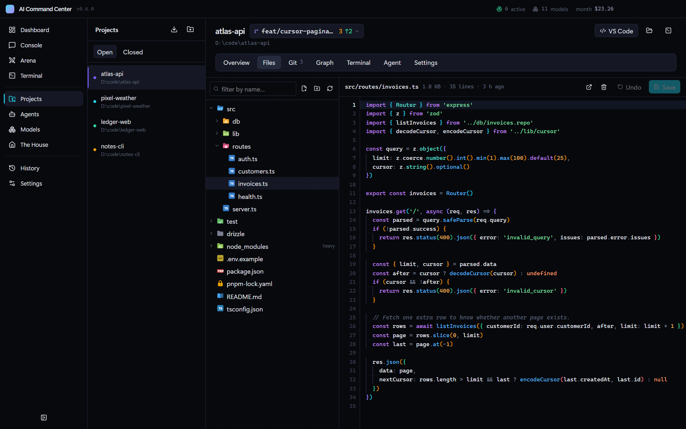
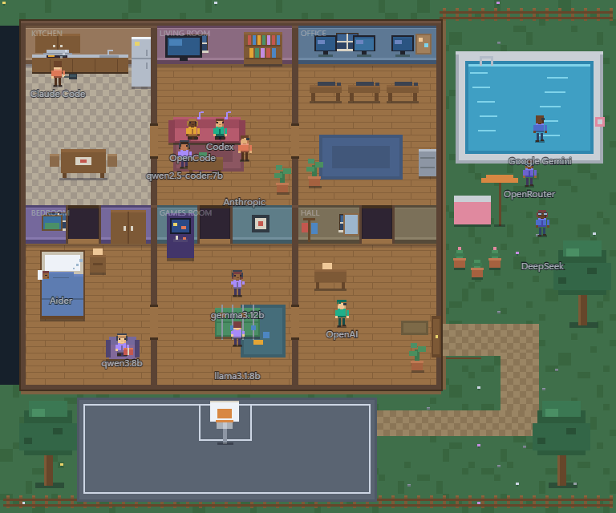

<div align="center">


# AI Command Center

**English** · [Español](README.es.md)

A local command center for your AIs, your agents and your projects.
Everything on your own machine: no account, no server, no telemetry.

[](https://github.com/Hredo/ai-command-center/actions/workflows/ci.yml)
[](https://github.com/Hredo/ai-command-center/releases/latest)
[](https://github.com/Hredo/ai-command-center/releases)
[](LICENSE)
[](#windows)
[](#macos)
[](#linux)

**[⬇ Download the latest version](https://github.com/Hredo/ai-command-center/releases/latest)**



<sub>A Claude Code agent working on a project, live. All screenshots use made-up demo data.</sub>

</div>

---

## Contents

- [What it is](#what-it-is)
- [A quick look](#a-quick-look)
- [**Installation**](#installation) — [which file](#which-file-do-i-download) · [Windows](#windows) · [macOS](#macos) · [Linux](#linux) · [build it](#build-it-yourself)
- [Verifying your download](#verifying-your-download)
- [First steps](#first-steps)
- [Updating and uninstalling](#updating-and-uninstalling)
- [Troubleshooting](#troubleshooting)
- [What it does](#what-it-does)
- [Providers](#providers)
- [Development](#development)
- [Cutting a release](#cutting-a-release)
- [Layout](#layout)
- [Where your data lives](#where-your-data-lives)
- [Contributing](#contributing)
- [License](#license)

---

## What it is

A desktop application for **Windows, macOS and Linux** that pulls together, in one place,
three things normally scattered across half a dozen tabs and terminals:

- **Access to your AIs** — 8,000+ models from 32 API providers, whichever command-line
  agents you already have installed (Claude Code, Codex, Aider, OpenCode…) and the local
  models you run through Ollama, all from the same console.
- **Analytics on what you spend** — cost per day, tokens, time to first token, generation
  speed, error rate and a model ranking. Including sessions you started outside the app.
- **Your projects** — files, a syntax-highlighting editor, full git with a commit graph,
  GitHub, real terminals and agents running inside each folder.

Everything runs locally. Keys are encrypted with your system's own credential store
(DPAPI on Windows, the Keychain on macOS, GNOME Keyring or KWallet on Linux) and the
history lives in your own files. There is no server, no account to create, no telemetry.

---

## A quick look

<table>
  <tr>
    <td width="50%" valign="top">
      <a href="docs/media/en/dashboard.png"></a>
      <p><b>Dashboard</b> — spend, tokens, latency and speed per model, what each provider says you have left, and your Claude Code usage including sessions started in other terminals.</p>
    </td>
    <td width="50%" valign="top">
      <a href="docs/media/en/arena.gif"></a>
      <p><b>Arena</b> — one prompt, several models or agents answering side by side, and a table that marks the best in each metric.</p>
    </td>
  </tr>
  <tr>
    <td width="50%" valign="top">
      <a href="docs/media/en/terminal.png"></a>
      <p><b>Terminal</b> — real consoles in tabs (ConPTY on Windows, a pseudo-terminal on macOS and Linux), so full-screen tools and interactive agents work with their colours.</p>
    </td>
    <td width="50%" valign="top">
      <a href="docs/media/en/graph.png"></a>
      <p><b>Git graph</b> — branches, merges and tags drawn per project; merge, rebase, cherry-pick or reset from any commit.</p>
    </td>
  </tr>
  <tr>
    <td width="50%" valign="top">
      <a href="docs/media/en/files.png"></a>
      <p><b>Files</b> — the project tree and an editor with syntax highlighting, indentation guides and a warning when an agent changed the file under you.</p>
    </td>
    <td width="50%" valign="top">
      <a href="docs/media/en/house.gif"></a>
      <p><b>The House</b> — every AI you have lives here; the ones with work in progress get up and do chores.</p>
    </td>
  </tr>
</table>

---

## Installation

**[Windows](#windows)** · **[macOS](#macos)** · **[Linux](#linux)** · [build it yourself](#build-it-yourself)

### Which file do I download?

Everything is on the **[downloads page](https://github.com/Hredo/ai-command-center/releases/latest)**,
under **Assets**. Pick the line for your system:

| Your system | Download | What it is |
|---|---|---|
| **Windows** 10 or 11 | `AI-Command-Center-Setup-0.7.0.exe` | Installer (recommended) |
| | `AI-Command-Center-0.7.0-x64.zip` | Portable, nothing to install |
| **macOS** with an Apple chip (M1, M2, M3, M4…) | `AI-Command-Center-0.7.0-mac-arm64.dmg` | Disk image |
| **macOS** with an Intel processor | `AI-Command-Center-0.7.0-mac-x64.dmg` | Disk image |
| **Ubuntu, Debian, Linux Mint, Pop!_OS**… | `AI-Command-Center-0.7.0-linux-amd64.deb` | Package, installed with `apt` |
| **Any other Linux** (Fedora, Arch, openSUSE…) | `AI-Command-Center-0.7.0-linux-x86_64.AppImage` | Single file, nothing to install |
| Linux on **ARM** (Raspberry Pi 5, Ampere…) | `…-linux-arm64.deb` or `…-linux-arm64.AppImage` | Same as above, for ARM64 |

> **Not sure which Mac you have?** Apple menu → **About This Mac**. If it says *Chip Apple
> M…*, take `mac-arm64`; if it says *Processor … Intel*, take `mac-x64`.

### Requirements

| | Windows | macOS | Linux |
|---|---|---|---|
| **System** | Windows 10 (22H2 or later) or 11, 64-bit | macOS 13 Ventura or later | 64-bit (x64 or ARM64). Tested on Ubuntu 24.04 |
| **Disk** | Around 400 MB | Around 400 MB | Around 400 MB |
| **Administrator** | Not needed | Not needed | Only for the `.deb` (`sudo apt`). The AppImage needs nothing |

No Node, no Python, no compilers: everything is bundled.

Optional. Each one unlocks a part of the app, and none of them is required:

| Program | What it enables | Windows | macOS | Linux (Debian/Ubuntu) |
|---|---|---|---|---|
| `git` | The git panel and the commit graph | `winget install --id Git.Git` | `xcode-select --install` | `sudo apt install git` |
| `gh` | The GitHub panel | `winget install --id GitHub.cli` | `brew install gh` | `sudo apt install gh` |
| [Ollama](https://ollama.com) | Local models | `winget install --id Ollama.Ollama` | [the app from ollama.com](https://ollama.com/download/mac) or `brew install ollama` | [`install.sh` from ollama.com](https://ollama.com/download/linux) |
| Any agent CLI | Running it from the app | Claude Code, Codex, Aider, OpenCode, Gemini CLI… | same | same |

Anything you don't have shows up as "not found" on its own screen and the rest of the
application works exactly the same. Nothing breaks because something is missing.

> **Why every system warns you the first time.** The application is not signed with a
> paid certificate: on Windows that costs €200–400 a year, and on macOS Apple charges
> US$99 a year for the program that lets an app be *notarized*. This project is free and
> has neither. The warning **does not say the program is dangerous**; it says nobody has
> paid to certify who publishes it. The source is all here, the binaries are
> [built in the open by GitHub Actions](#cutting-a-release) — every package is installed
> and tested there before it is published — and you can [check](#verifying-your-download)
> that what you downloaded is exactly what was built, or [build it
> yourself](#build-it-yourself) and download no binary at all.

---

### Windows

#### Option A — Installer (recommended)

1. Download `AI-Command-Center-Setup-0.7.0.exe`.
2. Double-click it. **Windows will show you a blue warning**; that is expected and is
   explained [below](#windows-will-warn-you-why-and-what-to-do): click **More info**, then
   **Run anyway**.
3. Pick an install folder or keep the suggested one.
4. When it finishes you will have shortcuts on the desktop and in the Start menu.

It never asks for administrator rights and touches nothing outside your user profile.

#### Option B — Portable (no installation)

Useful if you would rather not install anything, if you want to carry it on a USB stick,
or if the installer is being blocked for you.

1. Download `AI-Command-Center-0.7.0-x64.zip`.
2. **Before extracting**, right-click the `.zip`, open **Properties**, tick **Unblock** at
   the bottom and click **OK**.

   > This step matters. Windows marks everything downloaded from the internet, and that
   > mark spreads to every file extracted from the zip. Unblocking the zip first saves you
   > the warning on every file inside it.

3. Extract the folder wherever you like.
4. Go in and run **`AI Command Center.exe`**.

It writes nothing to the registry and leaves no trace outside its own folder and the data
folder. To uninstall it, delete the folder.

#### Windows will warn you: why, and what to do

> **Windows protected your PC**
>
> Microsoft Defender SmartScreen prevented an unrecognized app from starting.
> Running this app might put your PC at risk.

Click **More info** and a **Run anyway** button appears. That's all, and it only happens
the first time.

**If there is no "Run anyway" button**, you have **Smart App Control** enabled — a
protection that ships on by default on clean Windows 11 installations and blocks every
unsigned executable without offering any choice. You have three ways out, in this order:

1. **Try the [portable build](#option-b--portable-no-installation)**, remembering to
   unblock the zip before extracting. It sometimes gets through where the installer
   doesn't.
2. **[Build it yourself](#build-it-yourself).** Anything produced on your own machine
   skips that filter. This is the route that always works.
3. Turning Smart App Control off is technically possible, but **it cannot be turned back
   on without reinstalling Windows**. Not worth it for one application — use option 2.

---

### macOS

1. Download the `.dmg` for your Mac: `mac-arm64` for an Apple chip, `mac-x64` for Intel.
2. Open it and **drag *AI Command Center* onto the *Applications* folder** in the same
   window.
3. Open it from Applications or Launchpad. **The first time, macOS blocks it** because it
   isn't notarized; this is how to let it through, once:

   **macOS 15 Sequoia and later (including macOS 26 Tahoe):**

   1. Double-click the app. A window says *"AI Command Center" Not Opened* (or that Apple
      could not verify it is free of malware). Click **Done** — not *Move to Trash*.
   2. Open **System Settings → Privacy & Security** and scroll down to the *Security*
      section. There is a line saying *"AI Command Center" was blocked to protect your
      Mac*. Click **Open Anyway**.
   3. Confirm with your password (or Touch ID) and click **Open Anyway** once more.

   **macOS 13 Ventura and 14 Sonoma:** right-click (or Control-click) the app in
   Applications, choose **Open**, and then **Open** again in the dialog. The *System
   Settings* route above works too.

   From then on it opens like any other app.

4. The first time a project or a terminal goes into your Documents, Desktop or Downloads
   folders, macOS asks whether AI Command Center may access them. Say **Allow**: that is
   where your projects live.

> **Prefer the Terminal?** This does the same as the steps in point 3 in one line:
>
> ```bash
> xattr -dr com.apple.quarantine "/Applications/AI Command Center.app"
> ```

Things that are specific to the Mac, and already taken care of:

- **Your command-line tools are found even when you open the app from the Dock.** A Mac
  app doesn't inherit your terminal's `PATH`, so `claude`, `codex`, `opencode`, `gh` or
  `ollama` installed with Homebrew, npm or pnpm would be invisible. The app asks your login
  shell (zsh, bash or fish) for its `PATH` when it starts.
- **Keys go into the macOS Keychain**, tied to your user.
- **Local models use the unified memory**: on an Apple chip there is no separate VRAM, and
  the recommendations are computed with the share macOS lets the GPU use.
- **The shortcuts use ⌘**: ⌘1…9 to switch sections, ⌘Enter to send, ⌘C/⌘V to copy and
  paste in the terminal (where Ctrl+C is still a real Ctrl+C).

---

### Linux

#### Option A — `.deb` package (Ubuntu, Debian, Mint, Pop!_OS, elementary, Zorin…)

From the folder where you downloaded it:

```bash
sudo apt install ./AI-Command-Center-0.7.0-linux-amd64.deb
```

(The `./` matters: without it `apt` looks for a package with that name online.) It shows
up in your applications menu as **AI Command Center**, and can be started from a terminal
with `ai-command-center`. The package also sets up Chromium's sandbox properly, including
the AppArmor profile Ubuntu 24.04 and later require.

#### Option B — AppImage (any distribution)

```bash
chmod +x AI-Command-Center-0.7.0-linux-x86_64.AppImage
```

```bash
./AI-Command-Center-0.7.0-linux-x86_64.AppImage
```

Or give it execute permission from your file manager (*Properties → Permissions → Allow
executing as program*) and double-click it. Nothing is installed and nothing is written
outside your home folder.

AppImages need FUSE 2, which some recent distributions no longer install by default. If it
doesn't open and a terminal shows an error about `libfuse.so.2`:

| Distribution | Command |
|---|---|
| Ubuntu 24.04 and later | `sudo apt install libfuse2t64` |
| Ubuntu 22.04, Debian | `sudo apt install libfuse2` |
| Fedora | `sudo dnf install fuse-libs` |
| Arch, Manjaro | `sudo pacman -S fuse2` |

> **On Ubuntu 23.10 and later, prefer the `.deb`.** Those versions only let an app use the
> user namespaces Chromium isolates its windows with if the app has an AppArmor profile,
> and only the `.deb` can install one. The AppImage still opens and works — its launcher
> detects the restriction and starts the app with `--no-sandbox` rather than crashing —
> but without that isolation, and **Settings → Security** says so. On Fedora, Arch and
> most other distributions there is no such restriction and the AppImage runs isolated.

#### Keys on Linux

Keys are encrypted with your session's keyring (GNOME Keyring or KWallet), which GNOME and
KDE desktops come with. On a desktop without one the app **does not pretend**: the
Security screen tells you keys are stored encoded, not encrypted. Install `gnome-keyring`,
or pass your keys as environment variables (`ANTHROPIC_API_KEY`, `OPENAI_API_KEY`…) instead
of saving them in the app.

---

### Build it yourself

This is the cleanest route on any system: what you compile on your own machine goes
through no reputation filter, so there are no warnings of any kind.

You need [Node 22](https://nodejs.org), `git` and **pnpm** — never npm, it breaks the
`node_modules` tree. Node brings pnpm with it; enable it once with:

```bash
corepack enable pnpm
```

On macOS you also need Apple's command-line tools (`xcode-select --install`), because the
terminal's native module is compiled on install. Windows and Linux need nothing else: it
comes precompiled.

Then:

```bash
git clone https://github.com/Hredo/ai-command-center.git
```

```bash
cd ai-command-center && pnpm install
```

```bash
pnpm dist
```

`pnpm dist` builds for the system you run it on, into `release/`:

| System | What you get |
|---|---|
| Windows | The installer and the portable zip. If your Windows won't let you generate the installer, `pnpm dist:zip` produces only the portable build and never needs to launch an executable while packaging |
| macOS | The `.dmg` for your Mac's architecture |
| Linux | The `.deb` and the AppImage for your architecture |

To work on the code without packaging anything: `pnpm dev`.

---

## Verifying your download

Every Release includes a `SHA256SUMS.txt` file with the fingerprint of each package. To
check that what you downloaded is exactly that, run this in the folder where you
downloaded it:

| System | Command |
|---|---|
| Windows (PowerShell) | `Get-FileHash '.\AI-Command-Center-Setup-0.7.0.exe' -Algorithm SHA256` |
| macOS | `shasum -a 256 AI-Command-Center-0.7.0-mac-arm64.dmg` |
| Linux | `sha256sum -c SHA256SUMS.txt --ignore-missing` |

The value must match, character for character, the matching line in `SHA256SUMS.txt` (on
Linux the command compares them for you and prints `OK`). If it doesn't, **don't run
it**: delete it and download it again.

---

## First steps

The application **starts empty on purpose**: it ships no keys, creates no account and
connects to nothing on its own. To make it do something you need at least one of these
three.

### 1. An API key

Any of the [32 providers](#providers) will do.

1. Open **Settings** and go to **Providers**.
2. Find yours and paste the key.
3. Done — it now shows up in the Console, in the Arena and in the model catalog.

> **Where your key ends up.** It is stored encrypted with your system's own credential
> store, tied to your user account — DPAPI on Windows, the Keychain on macOS, GNOME
> Keyring or KWallet on Linux — in `secrets.json` inside the
> [data folder](#where-your-data-lives). It never leaves your machine except toward the
> provider you are sending it to, and it is never written to the history or the logs. If
> you would rather not store it at all, the app also reads the usual environment variables
> (`ANTHROPIC_API_KEY`, `OPENAI_API_KEY`, `GEMINI_API_KEY`…).

### 2. A command-line agent

If you already use Claude Code, Codex, Aider, OpenCode or Gemini CLI, you need no key at
all: the app finds them on your `PATH` and runs them with your existing session.

1. Open **Agents**. Whatever you have installed shows up detected, with its version.
2. Pick one in the Console and start typing.

### 3. Local models, paying nobody

1. Install [Ollama](https://ollama.com) and start it.
2. Open **Settings** and go to **Local**. The app finds it by itself on `localhost:11434`.
3. From there you get your hardware, the models you have, and recommendations computed
   from your GPU's actual VRAM (or, on an Apple chip, the unified memory macOS gives the
   GPU). Install and remove them with one button.

---

## Updating and uninstalling

| System | Updating | Uninstalling |
|---|---|---|
| Windows | Run the new installer over the old one | *Settings → Apps*, or the uninstaller in the Start menu. Portable: delete the folder |
| macOS | Drag the new version onto *Applications* and choose **Replace** | Drag the app from *Applications* to the Trash |
| Linux `.deb` | `sudo apt install ./` followed by the new `.deb`'s name | `sudo apt remove ai-command-center` |
| Linux AppImage | Replace the file with the new one | Delete the file |

Updating keeps your settings, your keys and the whole history. To hear about new versions,
use *Watch → Custom → Releases* at the top of this repository.

**Your data is not deleted when you uninstall**, so reinstalling doesn't put you back at
zero. It stays in the [data folder](#where-your-data-lives); to really remove it, delete
that folder by hand.

---

## Troubleshooting

| System | Symptom | What's happening | Fix |
|---|---|---|---|
| Windows | "Windows protected your PC" | The app isn't signed | **More info** → **Run anyway** |
| Windows | No "Run anyway" button | Smart App Control is on | [Use the zip, or build it](#windows-will-warn-you-why-and-what-to-do) |
| Windows | Antivirus quarantines it | Common false positive for unsigned Electron binaries | Verify the [SHA-256](#verifying-your-download) and add an exception, or build it yourself |
| macOS | *"AI Command Center" Not Opened* / *can't be opened* | It isn't notarized | **System Settings → Privacy & Security → Open Anyway** ([step by step](#macos)) |
| macOS | *"AI Command Center" is damaged and can't be opened* | macOS says this when the quarantine mark and the signature don't agree; it isn't damage | `xattr -dr com.apple.quarantine "/Applications/AI Command Center.app"` |
| macOS | It doesn't find a CLI you installed with the app open | The `PATH` is read when the app starts | Quit it (⌘Q) and open it again |
| Linux | The AppImage doesn't open; error about `libfuse.so.2` | FUSE 2 isn't installed | [Install it](#option-b--appimage-any-distribution), or use the `.deb` |
| Linux | Security says the app started with `--no-sandbox` | The AppImage on Ubuntu 23.10+, which blocks the user namespaces Chromium needs | Use the `.deb`, which installs its AppArmor profile |
| Linux | Security says keys are "encoded, not encrypted" | There's no keyring in your session | Install `gnome-keyring`, or use environment variables |
| All | The app opens but everything is empty | That's normal at the start | Add a key or an agent: see [First steps](#first-steps) |
| All | The terminal opens and hangs | The native console binaries are missing | Download again; if you built it, run `pnpm install` then `pnpm dist` |
| All | The git panel says git is missing | `git` is not on your `PATH` | Install it ([table](#requirements)) and restart the app |
| All | The GitHub panel asks you to sign in | GitHub's CLI isn't installed | Install it ([table](#requirements)), then `gh auth login --web` |
| All | Ollama doesn't show up | The server isn't running | Start it, or use the button in **Settings → Local** |
| All | A provider returns 401 | Wrong or expired key | Paste it again in **Settings → Providers** |

None of this helps? [Open an issue](https://github.com/Hredo/ai-command-center/issues/new/choose)
with your system and its version, how you installed the app, and what you did right before.

---

## What it does

**Dashboard** — spend per day, input and output tokens, average time to first token,
generation speed, error rate, and a ranking of models by cost and performance.

**Console** — conversations with any model or with a command-line agent. While it answers
you see live metrics (elapsed time, first token, estimated tokens and speed); when it
finishes those are replaced by the provider's real numbers. Each conversation is a session
you can close, reopen, rename, pin or delete, and it survives closing the application.

Around every turn you see what the model or the agent actually reports:

- **Reasoning**, collapsible, when it publishes any. From the APIs come Anthropic's
  thinking blocks, `reasoning_content` from the OpenAI-compatible ones, Gemini's
  *thoughts* and Ollama's `thinking`. From command-line agents, Claude Code's `thinking`
  blocks and OpenCode's `reasoning` events. If an agent publishes none, it says so; it is
  never reconstructed by guessing at the output.
- **Context** consumed against the model's window, in tokens and as a percentage.
- **Rate limits**: how many requests and tokens are left, and when they reset. It comes
  from the provider's response headers, so it only appears if the provider sends it.

In the conversation sidebar there's a **usage** panel keeping the three things apart: how
much context you've spent and how much still fits, how many requests and tokens are left
on your plan, and a countdown to the reset. Whatever the provider doesn't publish is said
in those words, instead of drawing half a bar. The Dashboard collects the same from every
provider that has answered since you opened the app.

**Claude Code** gets its own section on top of that: what you've spent in the five-hour
window and over the last seven days, with the messages and sessions in each, and a
countdown to the reset when the agent itself announces one. It also counts what you run
outside the application, because it reads the transcripts Claude Code leaves in
`~/.claude/projects`. Two caveats the panel states in writing: cache-read tokens are kept
separate — added in with the rest they'd reach hundreds of millions in an afternoon — and
the money shown is what it would cost at API prices, which on a paid plan is not what you
pay. Nobody publishes the plan's ceiling, so no percentage is drawn: you get the real
spend and the reset time, and it stops there.

- **Files it touched**: the ones that actually changed, measured by diffing the repository
  before and after, with lines added and removed; and separately the ones the agent says
  it opened, distinguishing what it only read from what it edited.
- **Branch** it ran on, with a picker to switch branches or create a new one.
- **Attachments**: you pick files and they travel with the prompt. An API model gets the
  contents (truncated if oversized, and it says so); a command-line agent gets the paths,
  since it knows how to open them.
- **Reasoning effort**, from minimum to maximum. Every provider asks for it differently
  and it is translated automatically: thinking budget on Anthropic and Gemini,
  `reasoning_effort` on OpenAI, `think` on Ollama, and each CLI's own option on claude,
  codex and aider. On "Automatic" nothing is sent, so the request goes out exactly as it
  always did. If a provider rejects the field, it is retried without it instead of
  failing.
- **What the agent is doing**, step by step and while it happens: every thought and every
  tool with its name, on which file or which command, how long it took, whether it
  succeeded, and the **+N −M** of what it edited. At the top, a summary of the run: how
  many actions, how much was added and removed, across how many files. It stays open while
  running so you can see it hasn't hung; when it finishes it folds away and leaves the
  answer clean. What the agent doesn't report isn't drawn: if a tool doesn't say how many
  lines it touched, no counter appears.
- **Model and permissions for the console agent**, where its CLI supports them. On Claude
  Code you pick the model (Fable, Opus, Sonnet, Haiku) and how much latitude it gets:
  edit on its own, do everything without asking, stay in plan mode, or ask. Denied
  permissions show up in the timeline as exactly what they are — a step that wasn't
  allowed.

**Arena** — the same prompt against two, three or four contenders at once, in columns,
streaming simultaneously. A contender can be an API model or a command-line agent; both
end up in the same comparison table, which highlights the best in each metric. You mark a
winner and it is saved.

**Terminal** — real terminals inside the application, in tabs. Behind them is a real
console (ConPTY on Windows, a pseudo-terminal on macOS and Linux), so full-screen
applications work: opencode, vim, agents in interactive mode, all with their colors and
their interfaces. Ctrl+C is a genuine Ctrl+C. Each tab's path and each command's duration
come from a shell integration that only adds invisible markers to the prompt — for
PowerShell, bash, zsh and fish, loading your own configuration first so your prompt,
aliases and `PATH` stay exactly as they are. On macOS every new terminal is a login shell,
as in Terminal.app.

**Projects** — you register folders, and from there you open them in VS Code or in your
file manager (Explorer, Finder…), get a terminal of the project's own, and launch agents inside with their output
live. The app scans the project: git branch, languages, package manager, AI dependencies
and the names (never the values) of its `.env` variables. `package.json` scripts run by
clicking them, in the built-in terminal. A project can be **closed**: it stays saved with
its history but leaves the list, and reopens whenever you want.

Each project also has:

- **Files** — a folder tree that expands one level at a time (heavy ones like
  `node_modules` are flagged and only read if you open them yourself), and an editor with
  Ctrl+S, line numbers, and a warning if the file changed on disk since you opened it,
  which is what happens when an agent has been working behind your back. Code is
  **syntax-highlighted** — comments, strings, numbers, keywords, types and calls — with
  **indentation guides** marking each level, and Tab inserts a tab instead of jumping
  between controls. The highlighting is homegrown, no library: a handful of regular
  expressions per language family (TypeScript, JavaScript, Python, shell, JSON, CSS, HTML,
  YAML, SQL, Go, Rust, C, Java, PHP, Ruby and Markdown). The same colors apply to code
  blocks in chat replies, guessing the language when the markdown fence doesn't say. You
  can create, send to the recycle bin (the Trash on a Mac), and reveal in Explorer or
Finder. Every path is resolved
  against the project root: one `..` too many is rejected.
- **Git** — what changed with its line counts, the diff of each file, stage, commit,
  stash and pop, fetch, pull, push, and a box for any other git command. The box is not a
  shell: the command is split into arguments and goes straight to git, only subcommands
  from a list are accepted, and the ones that can throw work away (`reset --hard`,
  `push --force`) ask for confirmation. Interactive things (a `rebase -i`, which would
  open an editor) are sent to the built-in terminal, where they make sense.
- **Graph** — the history drawn: one lane per branch, merges with their curve, and the
  labels of every local branch, remote branch or tag on its commit. Clicking a commit lets
  you **merge**, **rebase**, **cherry-pick**, **revert**, create a branch or a tag right
  there, check it out, or reset back to it keeping or discarding what came after. If a
  merge or a rebase stalls, the top of the panel says what is going on, which commit it is
  at and which files are conflicted — they open in the editor with one click — with
  **continue**, **skip** and **abort**. The actions are not free text: the interface says
  what it wants to do and the main process assembles the git call, so a branch name can't
  smuggle in a flag. Git runs with no editor and no questions (`GIT_EDITOR=true`), so
  nothing sits waiting for a keyboard that isn't there.
- **GitHub** — you sign in with its official CLI (`gh auth login --web`): the browser
  opens and you authorize it yourself. The application never sees or stores your password
  or your token; it only asks `gh` which account it is on. From there you browse and
  search your repositories, and clone any of them into a folder you pick — registered as a
  project in the same gesture.

**Agents** — two kinds, and both work as agents: they use tools and loop as many times as
needed to finish the task. API agents are a model with its instructions, effort and
permissions: they read, search, edit and run commands with the app's tools, in the project
or, without one, in their own folder. Command-line agents are the CLIs you already have
installed (Claude Code, Codex, opencode, Aider, Gemini CLI…): the app finds them on your
PATH and runs them inside the project. From Claude Code and OpenCode it extracts real
tokens and cost. For OpenCode you pick the provider —Zen or your Ollama models—, the model
and the effort; with Ollama, every model always runs with its full context window.

And also the sessions you did **not** start here: if you open `claude` in any terminal,
that conversation still lands in the history and the statistics, with its project, its
model, its messages and the files it touched, flagged as having come from outside. It is
read from Claude Code's transcripts, which only grow at the end and are never rewritten,
so they are read in full once and after that only the new part; meanwhile the folder is
watched, so a session that is still alive shows up while you work, not whenever you
remember to look.

**Models** — a dynamic catalog with over 8,000 models from 200 providers and their prices,
pulled from models.dev and OpenRouter. Click a model and its card opens: context, prices,
modalities and links to its page, its weights or its documentation. When a provider
publishes no per-model page, it says so and links their list instead of inventing a URL.

**Local** (in Settings) — Ollama management without leaving the app: server status and a
button to start it, your hardware, the installed models with their size, and
recommendations computed from your GPU's real VRAM and each model's real size according to
Ollama's registry. Install and remove from there, with a progress bar.

**The House** — the one screen that doesn't configure anything: it's there to look at.
Every AI the application detects — each console agent, each local model, each provider with
a key — lives in a house drawn pixel by pixel, in plan and three-quarter view, with a
kitchen, living room, office, bedroom, games room, garden, pool and basketball court.

If you give it nothing to do, each one is resting: on the sofa, having a nap, at the
arcade machine, in the water or shooting hoops, moving somewhere else now and then. Give
it a task and it gets up and starts doing chores around the house — cooking, washing up,
sweeping, watering, typing in the office. Give it two at once and an identical neighbour
comes in through the front door for the second one, leaving the way they came as soon as
that task ends. Hovering tells you who it is and what they're doing.

All the artwork is original: no images, no downloaded sprites, nothing generated
elsewhere. It's painted on a 768×640 canvas and scaled up by a whole number with smoothing
off, which is what makes the pixels come out square instead of blurry. The animation stops
by itself when you switch tabs.

**History** — every run, with filters, a detail card and export to CSV or JSON.

**Notifications** — system notifications when a prompt, an agent, a comparison, a model
download or a terminal command taking more than twelve seconds finishes.

### Details that matter

**Nothing is interrupted by switching screens, or by switching windows.** Conversations,
agents, terminals and the Arena live in a global store in the renderer, not in the pages:
a screen you have visited stays mounted and is merely hidden, so you don't lose your
scroll position, your open terminal tab, or what you were halfway through typing. Each
terminal keeps its emulator alive; coming back to it resizes and refocuses without
repainting the scrollback from scratch.

The same goes for switching to another application. Chromium stops producing frames when
its window is minimized or covered, and text arriving in the meantime was left waiting for
a frame that never came: on return it all appeared at once and looked like the AI had
hung. Now there is a fallback timer — whichever fires first wins — and the window asks not
to be throttled in the background. It costs a little battery, and in exchange what runs in
the background actually runs. The top and side bars show how many tasks are in flight and
where.

**The screen doesn't go stale.** The main process watches each project's folder —
`fs.watch` for immediate notice, plus a sweep every four seconds for whatever slips past —
and tells the interface when the repository changes. Committing from the app, from an
outside terminal or from an agent makes no difference: the change list, the branch, the
graph and the file explorer update themselves, with no "refresh" to press. A notice is
only sent when the state really changed, so a sweep that finds nothing repaints nothing.
Same for spend and history: they are re-read when each run finishes.

**Local engines are detected on their own.** The main process probes their ports every few
seconds and tells the renderer when one appears or disappears: starting Ollama with the
app already open is noticed without pressing anything. If an engine only answers on one of
the two addresses (`127.0.0.1` or `localhost`), the one that works is remembered.

### Security

The renderer window runs with `sandbox`, `contextIsolation` and no Node access. It cannot
navigate anywhere, open new windows, or request camera, microphone or location. A content
security policy blocks loading anything that isn't its own. Messages arriving over IPC are
checked: that they come from the right window, and that the arguments are of the expected
type and size. Opening an external link means `http(s)` and nothing else. All of it lives
in [`src/main/security.ts`](src/main/security.ts), and the application displays it on its
own Security screen — so if somebody loosens a setting, it shows.

---

## Providers

32 in the catalog, speaking four protocols: Anthropic, OpenAI (and the ~20
compatible ones), Google Gemini and native Ollama.

**Cloud** — Anthropic, OpenAI, Google, OpenRouter, Groq, DeepSeek, xAI, Mistral, Together,
Fireworks, Cerebras, Perplexity, Cohere, Moonshot, Zhipu, Qwen, NVIDIA, SambaNova, Nebius,
Hyperbolic, Hugging Face, GitHub Models and Azure OpenAI.

**Local**, detected by port probing — Ollama, LM Studio, llama.cpp, vLLM, Jan, LocalAI,
GPT4All, KoboldCpp and Text generation WebUI.

---

## Development

Requires Node 22 and **pnpm** (never npm — it breaks the `node_modules` tree), on
Windows, macOS or Linux; on macOS also Apple's command-line tools (`xcode-select
--install`). The git panel needs `git` on the PATH, and GitHub needs its official CLI (see
the [table](#requirements)); without it the rest of the application works the same and
the panel says so.

`pnpm dist` prepares and checks, before packaging, the real console's binaries
(`scripts/check-native.cjs`). Without that check you can produce an installer that starts
fine and leaves the terminal hanging on the first tab: it happened once, because a failed
`node-gyp` had emptied `build/Release`.

```bash
pnpm install
pnpm dev            # hot-reloading app
pnpm build          # compiles to out/
pnpm dist           # packages for the system you are on, into release/
pnpm dist:win       # Windows: installer and portable zip
pnpm dist:zip       # Windows: only the portable version
pnpm dist:mac       # macOS: the .dmg for this Mac's architecture
pnpm dist:linux     # Linux: .deb and AppImage
pnpm typecheck      # typechecks both processes
```

**Self-test.** The application can check itself: started with `ACC_SELFTEST=<folder>`, it
opens with throwaway data, exercises the window, a real terminal with every shell it finds
(bash, zsh, fish or PowerShell), the agent's commands and the user's `PATH`, writes
`selftest.json` and two screenshots to that folder and exits with 0 or 1.
[`scripts/selftest.sh`](scripts/selftest.sh) launches it the way the Dock or a desktop
launcher would, with an empty environment. It's what CI runs on every system
([`src/main/selftest.ts`](src/main/selftest.ts)).

Verification:

```bash
pnpm exec electron scripts/smoke.cjs         # starts up and takes a screenshot
pnpm exec electron scripts/test-engine.cjs   # streaming engine, against a fake SSE server
pnpm exec electron scripts/test-pty.cjs      # real terminal: opencode, Ctrl+C, exit codes
pnpm exec electron scripts/test-terminal.cjs # the pipe-based fallback engine
pnpm exec electron scripts/test-features.cjs # sessions, links, detection, notifications
pnpm exec electron scripts/test-agents.cjs   # reasoning, context, limits, files, effort
pnpm exec electron scripts/test-workspace.cjs # project files, git and GitHub
pnpm exec electron scripts/shot.cjs Terminal # screenshots of one section
python scripts/make-icon.py                  # regenerates build/icon.png
```

`scripts/ollama-setup.cjs` sets Ollama up with the best models for the machine. With
`--dry-run` it only reports what it would do.

The tests use a local SSE server and fake agents — a Node script emitting the same events
as Claude Code and OpenCode, captured from the two real tools — so they spend no tokens
and touch no account. The git and file tests build a temporary repository and delete it
when they're done.

### Native dependencies

Exactly one: `@homebridge/node-pty-prebuilt-multiarch`, which provides the real console.
It is an N-API module, so the same binary works with any version of Node and Electron and
nothing has to be rebuilt for Electron. How it gets to `build/Release` depends on the
system, and `scripts/check-native.cjs` handles all three:

- **Windows**: its install script downloads it prebuilt — Visual Studio is **not**
  required.
- **Linux**: it ships prebuilt, but in `prebuilds/linux-<arch>/`, which is not where it is
  looked for inside Electron; the script copies it into place.
- **macOS**: it is compiled on install (hence the command-line tools), together with
  `spawn-helper`, which must stay executable or every tab dies with `posix_spawnp failed`.

If it ever failed to load, the terminal falls back on its own to a pipe-based engine that
groups output into blocks; you lose interactivity but the app keeps working, and it says so
on screen.

Nothing else is native, on purpose: the history is JSONL rather than SQLite.

pnpm 11 requires install scripts to be authorized under `allowBuilds` in
`pnpm-workspace.yaml`. Without that the module installs with no binary, silently.

---

## Cutting a release

The binaries are built by GitHub Actions, not on the development machine: that is the
only way to have a Windows, a Mac of each architecture and a Linux of each architecture at
hand every time. For Windows there is a second reason: on the development machine Smart
App Control is enabled and enforcing, so the NSIS installer **cannot even be generated** —
electron-builder needs to launch a temporary executable to write the uninstaller and
Windows won't let it.

Releasing is pushing a tag:

```bash
git tag v0.7.0 && git push origin v0.7.0
```

[`.github/workflows/release.yml`](.github/workflows/release.yml) builds, on clean GitHub
machines, the Windows installer and zip, the `.dmg` for Apple chips and for Intel Macs,
and the `.deb` and AppImage for Linux x64 and ARM64. Then it **installs each one the way a
user would** — the `.dmg` dragged into Applications, the `.deb` with `apt` under Ubuntu's
AppArmor restrictions — and runs the [self-test](#development) on it; on the Mac also
opened through the Finder, with launchd's bare environment. Only if all of them pass does
it compute the SHA-256 sums and publish the Release. Run from the *Actions* tab without a
tag, it does the same and publishes nothing.
[`.github/workflows/ci.yml`](.github/workflows/ci.yml) compiles and runs the self-test on
Windows, macOS and Linux on every push and every pull request.

The Mac app is signed *ad hoc* — which costs nothing and is what Apple chips need to run
it at all — but it is not notarized: that takes Apple's paid developer program, hence the
[first-open steps](#macos).

### Updating a Windows installation without the installer

All of the application's code lives in `resources\app.asar`, so on a machine where the
installer is blocked it is enough to replace that and leave the executable — which Windows
already allows — alone:

```bash
pnpm build && pnpm exec electron-builder --win --dir
```

```bash
powershell -ExecutionPolicy Bypass -File .\scripts\actualizar-instalacion.ps1
```

The script asks for elevation, closes the application if it is open, saves a dated copy
under `release\respaldo-<date>` and copies the new build in. To roll back, copy the
backup's `app.asar` over the current one. This only holds while the Electron version
doesn't change.

---

## Layout

```
src/
  shared/types.ts      the contract shared by all three processes
  main/
    index.ts           window, lifecycle and CSP
    ipc.ts             main channels, with errors turned into messages
    ipcExtra.ts        terminals, sessions, Ollama, links and notifications
    config.ts          config.json
    secrets.ts         keys encrypted with the system keyring (DPAPI, Keychain,
                       Secret Service)
    platform.ts        what changes between Windows, macOS and Linux
    shellEnv.ts        the user's shell PATH, for apps opened from the Dock
    selftest.ts        the self-test CI runs on every system
    runs.ts            JSONL history and metric aggregation
    sessions.ts        conversations you can close and pick back up
    terminal.ts        real console (ConPTY, or a pseudo-terminal on macOS and
                       Linux), shell integration and the pipe fallback
    ollama.ts          status, hardware, downloads and recommendations
    notify.ts          system notifications
    detect.ts          detection of providers, CLIs and local engines
    projects.ts        project scanning
    files.ts           project files, never leaving the project root
    git.ts             status, branches, diffs, commit graph and operations
    watch.ts           watches each project and reports repository changes
    usage.ts           the last thing each provider said about your limits
    claudeSessions.ts  reads Claude Code transcripts: usage windows and
                       sessions started outside the application
    claudeWatch.ts     watches that folder so a live session shows up running
    github.ts          session and repositories through gh
    attach.ts          prompt attachments
    effort.ts          reasoning effort, translated per provider
    security.ts        hardening: CSP, permissions and IPC validation
    providers/
      catalog.ts       the 32 providers
      models.ts        dynamic catalog and price computation
      links.ts         from a model to its page
      run.ts           streaming engine: 4 dialects and metrics
      limits.ts        rate limits read from response headers
    agents/cli.ts      command-line agent execution
  preload/index.ts     isolated bridge to the renderer
  renderer/
    lib/engine.tsx     live state for everything, outside the pages
    lib/ansi.ts        ANSI escape interpreter for fallback mode
    lib/highlight.ts   syntax highlighting and indent guides, no library
    lib/house.ts       The House's floor plan: rooms, doors, spots and the
                       residents' comings and goings
    lib/pixelArt.ts    The House's artwork, pixel by pixel, no images
    lib/i18n.tsx       the strings, in Spanish and English
    components/        Terminal (xterm.js), FilesPanel, Code (highlighting editor),
                       GitPanel, GitGraph (graph, merges and rebases), GithubPanel,
                       AgentPanel (context, usage, Claude's plan, branches),
                       AgentActivity (what the agent is doing), HouseCanvas,
                       Stats…
    pages/             the ten sections
```

---

## Where your data lives

| System | Folder |
|---|---|
| Windows | `%APPDATA%\AI Command Center\data\` |
| macOS | `~/Library/Application Support/AI Command Center/data/` |
| Linux | `~/.config/AI Command Center/data/` |

| File | What's in it |
|---|---|
| `config.json` | Providers, agents, projects and preferences |
| `secrets.json` | API keys encrypted with your system's keyring |
| `runs.jsonl` | One line per run, with all its metrics |
| `sessions.json` | Conversations and agent sessions |
| `models-cache.json` | Model catalog and prices |
| `shell-init.ps1`, `shell/` | The shell integration the terminal loads (PowerShell; bash, zsh and fish) |

Open it from **Settings → Preferences → Open data folder**.

None of this leaves your machine. There is no server to send it to, no telemetry, and no
license check.

---

## Contributing

Contributions are welcome, through the usual GitHub route:

1. **Fork** the repository.
2. Create a branch for your change (`git checkout -b fix-whatever`).
3. Make sure `pnpm typecheck` and `pnpm build` pass.
4. Open a **pull request** against `main`.

**The `main` branch is protected.** It cannot be pushed to directly, force-pushed, or
deleted: everything arrives through a pull request, with CI green, and the merge is
approved by the repository owner. That is why step 1 is a fork.

To report a bug, use the
[issue template](https://github.com/Hredo/ai-command-center/issues/new/choose): it asks for
your version and how you installed the app, which is what's needed to reproduce it.

---

## License

[MIT](LICENSE) — © 2026 Hredo.

You may use, modify and distribute it, including commercially, as long as the copyright
notice is kept. It is provided **with no warranty of any kind**.
